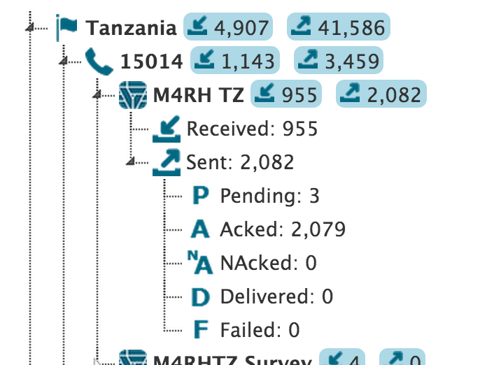

:index:`Credit Viewer`
========================

General
-----------

Vusion is keeping count of all messages -sent and received-, the Credit Viewer page aims to provide access those counters. 
Even program that have been deleted will still have their message count available.

### Credit vs Message

Note the distinction between Credit and Message. Basically, a Messages to/from a participant requires 1 or more Credit(s). 
Indeed Message are send though SMS which are limited in the number of character. For each SMS, Vusion will count 1 Credit.
In the Credit Viewer, all the count are Credit counts as opposed as in each program's History where the count is a Message count.

### Size of SMS

Depending of the country's operator and alphabet, the number of character that a SMS can contain can greatly differ.
SMS can contains 160 or 153 characters depending of various local specificity. 
For example some character with accent might be surported which will reduce the total number of character one can fit in a SMS. 
For countries with different alphabet like chineese or arabit the size of the SMS can be as low as 70 characters.

The Viewer
------------

Only those that have manager and administrator roles can access the credit viewer for now. 
If your account belong to one of those groups, a link will appear in the top black bar.

By default when accessing the page, the viewer will show today's credit only.

The credits are group by Countries. And one can already see a summary of the sent and received message per country.

### Exploring the counters

The counter are organized in a tree which each sub-level being a breakdown of the higer level. 
So the sum of all shorcodes sent credits is equal to the country's sent credits. Same apply for received credits.

First is *countires*. Within each countries, there is different *shortcodes*. 

Second is *shortcodes*. Within each shortcodes, multiple *programs* are running. 

Note that programs that are not spending any credits will NOT be displayed even though they might be running.

#### Programs Details

Within each program, a break down is also available for sent credits: 

#### Deleted Programs

Program that have been deleted will still appear in the credit view but with a grey icon.

#### Unmatchable Replies

When receiving messages. Vusion might fail to identify to which program it belongs. In such a case, the message is counted as the Unmatchable Reply. 
Note that an automatic response might have been define for this shortcode and therefor an response be send back to the originator of the message.

### Change the timeframe

One can change the timeframe for witch the credits are displayed. Click on the **Change** button to be able to choose either a predefined timeframe or fill specific dates. 
Then click on **Calculate** to access the data.

