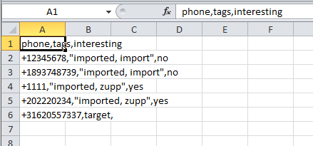
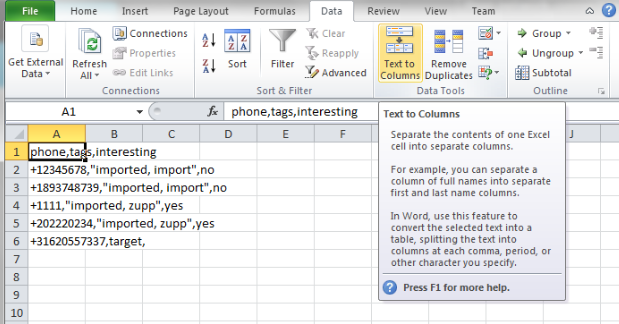
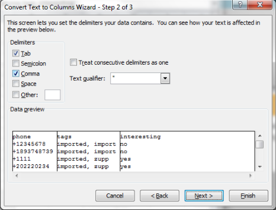
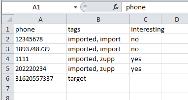

Using :index:`CSV files` in Excel
--------------------------------------

This guide covers the usage of CSV files in Excel. Vusion exports it's files with participant data and other kinds of data in a format called CSV. CSV stands for Comma Seperated Value. A CSV file exists of lines of values that are seperated by comma's. The very first line of the file usually consists of column headers.

These files can be opened in Excel. However, when you do that, Excel will not automatically format the data the right way. Instead it will look like this:

To be able to analyse them you need to perform an extra step.  As you can see, the text in the cells needs to be split by the comma seperators. There is a function in Excel that can do this for you. This function is called Text to Columns:

This will bring up a wizard. It is important to select the correct way to split the text. You need to split the text *delimeted* by *comma*

If you correctly split the text by it's comma seperators, it will now look like this:

Congratulations, you have succesfully opened your CSV export in Excel!