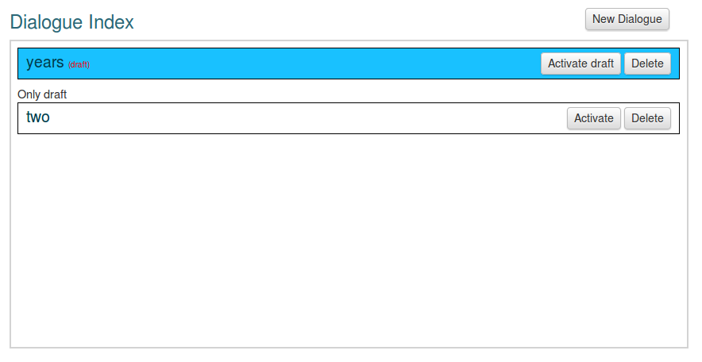

:index:`Dialogues`
++++++++++++++++++++

This guide will cover the Dialogue option in Vusion. Dialogues are used in Vusion to set up the most complex interactions with the participant. This section is aimed at experienced Vusion users and will not explain the basic Vusion concepts. 

Introduction into dialogues
============================
- What is a dialogue
- When do you use dialogues

When learning about Dialogues and how to use them, it is very important to understand the structure of a dialogue. 
A dialogue should be seen as a number of Interactions. An Interaction is either a message to the Participant, or a question you pose to the Participant. With a question there can be different types of questions, and answers to questions can in turn trigger actions or other responses. This can get really complicated if you lose track of the basic structure of the Dialogue. 

You can use Dialogues to create programs where you want to pose a series of questions to the Participant. A prime example of the purpose of Dialogues are SMS surveys. Surveys usually exist of a series of questions, where the next question is posed when the previous question has been answered. There can also be some logic involved in the structure of the survey. An example of that might be that when a person answers a question about his age, it could exclude him from further questions because the survey is only aimed at people in a specific age range. 

Dialogue index
=======================

Clicking on the Dialogues option in the program menu opens the Dialogue index. This screen will give an overview of the currently available dialogues. It may look like this:

Here we can see all important features of the Dialogue index together. These features are used to manage the dialogues. 

First of all in the top right corner is the New Dialogue button. By clicking this button you can create a new dialogue. Creating a dialogue is quite complex. It is explained in great detail in the next section.

Draft system
---------------
Under the New Dialogue button, there are two different dialogues. One is called "years" and the second one is called "two". As you can see they have different colours. These colours have different meanings. When a dialogue is shown as white, it is a new dialogue that has not been activated yet. It has an "Activate" button and a "Delete" button. The dialogue will not be operational untill it is activated. 

When a dialogue is active, it will be shown as blue in the Dialogue Index. As can be seen on the image, the "years" dialogue is shown as blue so it is an active dialogue. You can inspect the contents of the dialogue by clicking on its name.

Note that next to the name there is a small red text saying (draft). When someone edits an active dialogue the new version will be saved as a "draft" version. It will not be activated right away, but instead it will generate the red text saying "draft", and a button saying "Activate Draft". Now you have two versions of the dialogue. There is the original version that is still active, and there is a draft version that is not active. You can edit the draft version by clicking the red (draft) text. When you have finished editing, and you want to replace the old version with the draft version, simply click "Activate Draft". Now the old version will be removed and the new version will be activated.

This system allows you to create and alter a dialogue without it becoming active right away so you can check it and remove all errors before it is activated to all participants.

Creating a dialogue
=====================
	
	When creating a dialogue, first clearly define the questions and messages. When to send, what happens with certain answers etcetera. This will help you with getting the structure of the survey right.

Name, Prioritize toggle & Automatic enrollment
-------------------------------------------------

	The first things you have to do when creating a new Dialogue is choose a **Name**. 

	After that there is a checkbox to decide if you want to use the **Prioritize** functionality. Ticking this box will give outgoing messages of this dialogue priority in Vusion. This can help to make sure messages are delivered on time, even if Vusion is very busy.

	With the **Automatic Enrollment** feature you can automatically enroll all the participants currently in the program into this new dialogue. This is especially useful when the participants have been imported from a file, and a new survey is created. 

	When these options are set up, you can start adding interactions to your dialogue.

Interactions
-------------

	Interactions are the building blocks that a dialogue consists of. An interaction should be seen as a question (or in some cases just a message) that is sent to a participant. The participant will then answer the question. It is also possible to add actions to different answer options. These options together create a powerfull 

	To add an interaction to a dialogue, simply click the Add interaction button. A yellow box will show up representing the new interaction. In this box there are quite some options available to correctly set up the question. 

Defining an interaction
------------------------

	When setting up an interaction, the first thing you need to do is define when the interaction will take place. For this there are four options you can select. 

	#. **Fixed time:** Start this interaction on a fixed date and on a fixed time. Example: May 1st at 9:00 AM.
	#. **Offset time** Start the interaction a number of minutes after the participant has been enrolled in the dialogue. Example: 30 minutes after enrolling
	#. **Offset days** Start the interaction a number of days after the participant has been enrolled in the dialogue, and at a specific time that day. Example: 7 days after enrolling, 11:00 AM
	#. **Answer required**: Start the interaction after another question has been answered. This will give you a dropdown box where you can select a previous interaction. When that question has been answered, this interaction will start. Note: This will not be available for the first interaction in a dialogue

	Now the timing of the interaction has been set, we have to define the interaction content. There are three types of interaction content available, being anouncement, question and question multi-keyword. They all have their own options and settings. They will be explained in the sections below.

Anouncement
^^^^^^^^^^^^

	The anouncement interaction is the most simple interaction. It is nothing more then a message that will be sent to the participant. When selected you are presented with a textbox to write your message. No additional options or features are available.

Question
^^^^^^^^^^^

	To set up a question, select the Question tickbox. Now a lot more options show up. The next section will attempt to explain all the options available. 

	First in the Content box you can write the question you want to ask the participant, along with some instructions on how the participant should format his answer. 

	Next in the Keyword box you can define the keyword associated with this question. The answer a participant gives should be formatted as: [Keyword] + [Answer]. Make sure you do tell participants exactly how the answer should be formatted.

	Next is a checkbox saying: "Use template from program settings". This is a legacy feature, which should be left unchecked. 

	Now you have the choice if you want to create an open or a closed question. Generally for questions with a limited number of possible answers a closed question should be defined. If there are a large amount of possible answers, define an open question. 
	Important to note is that when defining an open question it is not possible to add an Action. With a closed question this is possible, so this is what you should keep in mind while choosing your question type.

	Selecting the question type will again open up some options. 

	First for the open questions: Open questions will ask you to define an Answer label. The answer given to the question will be stored in the participant profile using this label. Example: set Answer label to "Age", when a participant answers the question he will gain a label called Age with his answer as the value. Also open questions give you the option to add some feedback when the question has been answered. 

	Closed questions also have the Answer label option. 

	Then there is the "Accept no space between keyword and choice" option. If this option is checked, Vusion will expect for instance "age24" as an answer to a question with keyword "age". When this is not checked, the answer "age 24" is expected. A subtle difference. 

	After this the possible answers need to be defined. If you have a "yes" or "no" question, define two answers. One for "yes" and one for "no". Now you can add feedback and actions for both the possible answers. 

	Now the question and possible answers are set up. The interaction is almost defined. Now there are a couple of options that can be set. First the maximum number of unmatching answers. When checked, you can define a maximum number of unmatching answers, and also add an action for when there are more unmatching answers. You could for instance opt-out the participant after a number failed attempts at answering.

	Then you can automatically send feedback when the answer is not matchable. You could for example use this to explain the correct format of the answer when an unmatchable answer is recieved. 

	Finally as the last option you can set reminders for when no answers are recieved after a certain amount of time. When this option is selected, a box appears where the number of reminders can be set. There is also an option to select the offset time of the reminders. This time can be set in minutes or in days. Finally you can attach an action to the reminder, to perform additional tasks. 

	Now the creation of your question is completed. 

Question multi-keyword
^^^^^^^^^^^^^^^^^^^^^^^^

	Setting up a multi-keyword question is a bit easier than a normal question. To understand why, it is important to know what the difference between a normal question and a multi-keyword question is. As explained above, when answering a question the answer is always formatted as [Keyword] + [Answer]. The keyword is used to recognise what question is answered and the answer can be saved and interpreted. 
	Multi-keyword questions work a bit differently. In multi-keyword questions all the possible answers are set up as different keywords. This means that when you set up a question multi-keyword style, the participant only has to answer with [Answer], and Vusion will recognise it as one of the answering possibilities. 

	.. admonition:: Example
		:Class: example
		

		When setting up a question asking for the gender of the participant, the answer format in normal question style would be [keyword] + [answer], so for example: 

		GENDER MALE

		When the question is set up as a multi-keyword question, the answer format will be simply [answer], so:

		MALE

	What you should note is that only multiple choice questions can be configured as multi-keyword questions, this is because you have to define the possible answers when setting up the question. Another important thing to remember is that when setting up a multi-keyword question, all the answer possibilities will be set up as keywords, just like the keywords used for triggering requests. As each keyword can only be used once on a shortcode, you will have to be very careful when setting up multi-keyword questions. This is especially true when there are multiple programs running on the same shortcode. 

	Setting up a multi-keyword question is very much the same as setting up a normal closed question. First you enter the content of the question you want to ask the participant, and select a label under which the answer will be stored. 

	After that you have to define the possible answers. Because each answer will also be set as a keyword, Vusion will automatically check if the keyword is still available. When a green tick appears, the keyword is accepted. Now it is possible to add feedback and actions to the answer, just like with a normal closed question. 

	When all the answers are set up, there is again the possibility to add reminders to the question by ticking the Set Reminder box. Fields will appear to let you select the number of reminders, the reminder offset and possibly add actions to the reminder. 

This describes the entire process of creating a dialogue. As you have seen there are a lot of options and a lot of possibilities to create the dialogue in a way that suits the program. Before when creating a dialogue it is important to allways keep the overall structure in mind. This way you will not get lost in the options and lose overview. 

