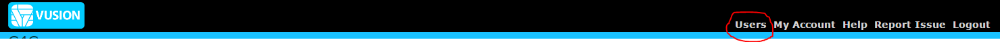
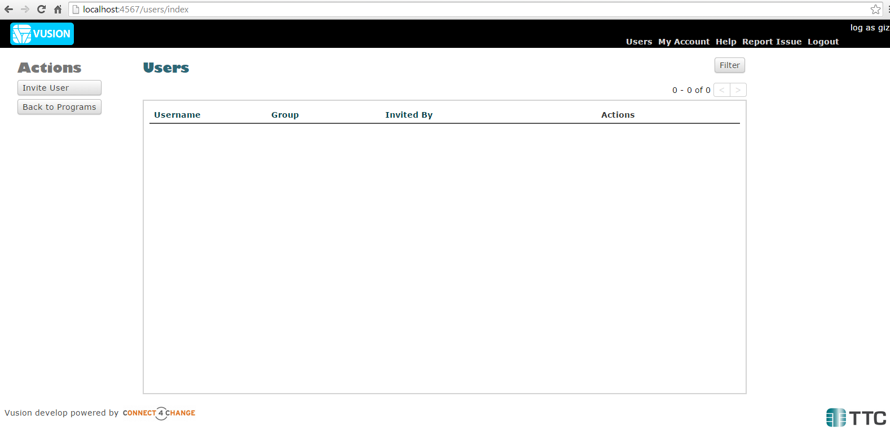
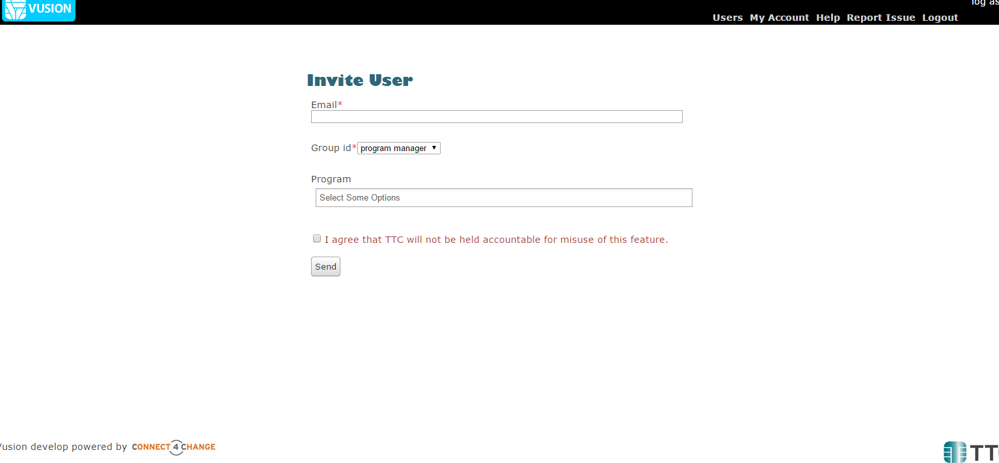
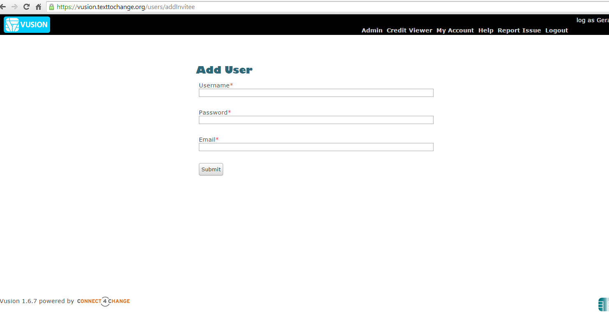

:index:`Invite User`
######################

Use Case
----------
Consider following use case: As an Organization that is running a program on VUSION, you would like to be able to grant access to certain members of your institution access to your program. Using the Invite user functionality will allow you to do just that.

Please note:
::
	"NOTE that the invite user functionality is User specific. Only users with rights to perform this action will be able to do so."

How To Invite a User
------------------------

When you have successfully logged in, look at the top right of the black bar. You will see a link for Users as seen below:

Click the Users link and you will be taken to the users index page, as below:

In this case, the above user has not yet invited anyone, so his users index is blank.

To invite a user, click on the Invite User button on the left of the screen. You will be taken to the page below:

* *Email* in this textbox, you enter the email address where the invite will be sent.
* *Group id* is a drop down list, from which you will select the user level that the invited person will have. There are three levels that one can invite namely *program manager, partner manager and partner*. For more details on users, please see :doc:`Understanding User Levels </advanced/understanding-user-levels>`
* *Program* is a multi-select drop down list from which you can choose the program(s) that the invited user will be able to access. Click inside the textbox to access the list.
* Check/Tick the disclaimer and click Send to send the invite.

:index:`Invite Email`
------------------------------

This is an example of invite email that will be received:
::
	"Hello,

	[Username] has invited you to create an account on VUSION.

	If you are not interested or if this email was sent in error, then ignore this message.

	Otherwise click the link below in order to set up your account.

	(Link expires after 7 days, can only be used once)

	http://vusion.texttochange.org/users/useTicket/f3150dc24c049e607957aa71b5cdace6

	Thanks

	(Please don't reply to this email) "

The link can only be used ONCE. When the link is clicked, you will be taken to this page:

And you can create your account for VUSION.
