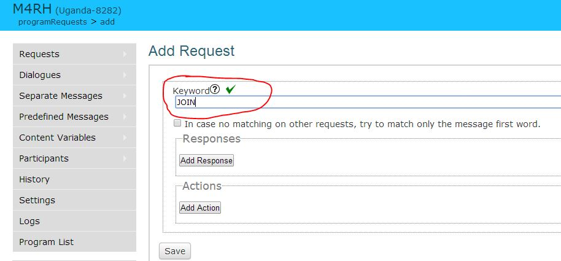
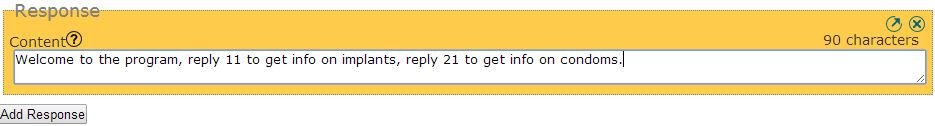
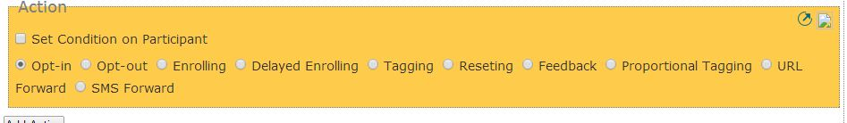
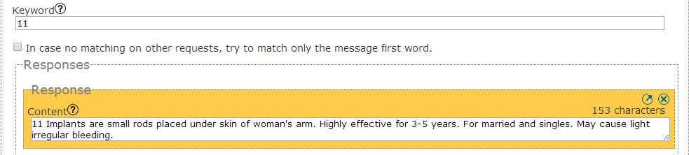

Menu style program
===================

A Menu Style Program is an on-demand source of information available to participants. To opt-in, the participant has to know the MENU KEYWORD. The response to this MENU KEYWORD will list the different OPTION KEYWORD that the participant can later access.
For example, a MENU KEYWORD is JOIN and returns the message Welcome to the program, reply 11 to get info on implants, reply 21 to get info on condoms. When participant would send 11, he would get one or more messages about implants.

How to
-------
To setup a basic Menu Style Program, user rely on Vusion’s Request and actions OPT-IN. Find below the step by step implementation of the example from the description.

**A :** Create the MENU KEYWORD 
**1 :** Go to requests, create a new request
Enter the keyword, for example **JOIN**

**2 :**  Add response, for example **Welcome to the program, reply 11 to get info on implants, reply 21 to get info on condoms**
	

**3 :** Add action OPT-IN

**4 :** Save and exit 

**B :** Create OPTION KEYWORD 11.  
**1 :** Go to requests, create new request. 
**2 :** Enter the keyword, for example 11. 
**3 :** Add response for example 11 Implants are small rods placed under skin of woman’s arm. Highly effective for 3-5 years. For married and singles. May cause light irregular bleeding

**4 :** save and exit

**TIP1 :** it is recommended to split long response into multiple response of 160character. Indeed in sending a SMS longer that 160char would increase the risk of the participant only receiving part of the response. 

**TIP2 :** When a keyword returns multiple response the order on which the participant receive them IS NOT GARANTEE. Neither is garantee that all will arrive. 

Real Example
-------------
One Menu style program is the M4RH program in Uganda on SHORTCODE 8282. 
Participants can contraception and family planning information. The menu response is available by sending the keyword M4RH to short code 8282: “Welcome to M4RH free info service. For Implants reply 11. IUD 21, permanent 31, Inject able 41, pills 51, EC 61, condoms 71, Natural family planning 81, LAM 91”.
TTC partner was USAID which funded this program from 
06/06/2010 and stopped 10/06/2014.
More 24000 Participants got involved and more than 652000 messages were sent.

The program is still available on Vusion at the URL: http://vusion-test.texttochange.org/m4rh

	

