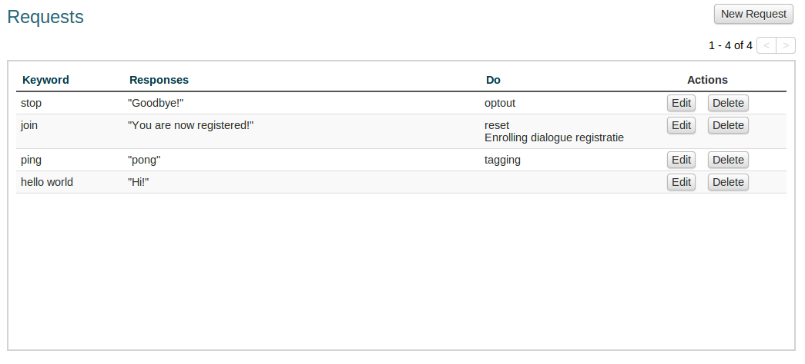
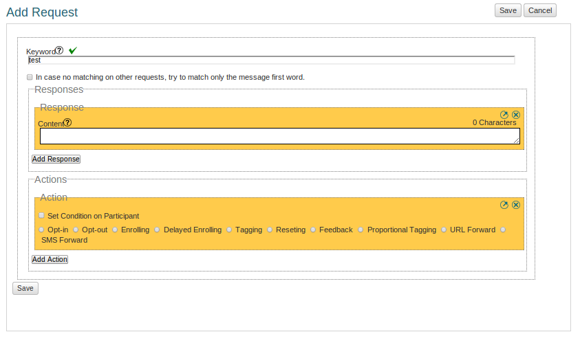

Requests
+++++++++++++

In Vusion there are different ways of implementing interaction with the participant. One of those ways is through Requests. Using Requests is a way to automatically perform some action when a message comes in that contains a certain Keyword. When you set up a Request you choose a Keyword to match, and you also choose an action you would like Vusion to perform if that Keyword is recognized.

To manage the Requests of the program, click Requests in the program menu. This will take you to the Requests screen. Here you can see a list with currently active requests with Keywords, Responses and Actions. 

	The Requests screen

As you can see there are a number of Requests currently active. Each Request has it's own Keyword, with different responses and different actions. 

To create a new Request, click the New Request button. Here you can add a Request to your program. There are 3 things that need to be set up when creating a Request.

 1. The Request has to have a unique keyword so messages can be recognized.
 2. The Request can have one or more Responses. A Response is an automated answer when a message comes in containing the Keyword.
 3. The Request can have one or more Actions. Vusion can do a number of Actions, from simple ones like adding a tag to a participant to more complicated ones who trigger events or schedule messages. Actions are explained in more detail below.

The Add Request screen lets you set up a new Request.

	The Add Requests screen, here you can create a new request

There are a number of things that need to be set up.

Keywords
===========

The first thing to set up when creating a Request is the Keyword. The Keyword is used as an identifier. All messages starting with the Keyword will be processed in Vusion as a Request. In order to be able to correctly identify and process messages, the Keywords have to be unique. Luckily Vusion automatically checks if the Keyword you want to use is already being used by some other Request. 

.. note:: 
	In Vusion keywords are not case-sensitive so the keyword *STATUS* will match *status* and also *StaTUs*. 
	Important to note is that Keywords have to be unique, not only for the program but for the shortcode the program is running on. In most countries there are only one or two shortcodes available to us, while we run many more programs. This means different programs have to run on the same shortcode. Vusion will always make sure that you do not use a keyword that is already in use, but it still is important to keep this mind while setting up Keywords.

To set up the keyword you can simply enter it in the Keyword field.

The checkbox below the Keyword field affects how certain text messages are matched to the Keyword. It is very important to understand exactly what it does as the effects are quite subtle. It has to do with if Vusion should match the Keyword to the complete message or only to the first word. For example:

A program manager is setting up a keyword "STATUS" for a program. 

Case 1: The checkbox is not checked
Vusion will only match messages to this request that contain **only** the Keyword. So Vusion will match the message:
	
	*Status*

But Vusion will **not** match:

	*Status please, i want my status!*

Case 2: The checkbox is checked
Now Vusion first tries to match the whole message to a Keyword. However when this fails, it will try and match the first word of the message to the Keyword. In this case, Vusion will still match

	*Status*

And it will **also** match 

	*Status please, i want my status!*

This difference in these two cases is important to understand. It is based on the difference between matching the whole message versus matching the first word of the message. When setting up a Request you should carefully decide which one in order to achieve the correct result. 

When the Keyword has been succesfully matched, Vusion can do two things. Send a Response to the participant, and perform an Action.

Response
============

The Response is used to automatically reply to the participant. To add a Response message to a Request, click the Add Response button. A yellow box will show up in which you can define a message that will be sent to the participant. 

You can add more then one response to a Request by simply clicking on the Add Response button multiple times. You can delete a response by clicking the X in the upper right corner of the yellow response box.

Actions
===========

Next to automatically sending a Response as explained above, we can do a lot more with Requests. It is also possible to make Requests trigger Actions. This is where the Vusion platform really shows it's versatility and it's possibilities. It is also where configuring Vusion gets complicated, because Actions can schedule and trigger other events. 
There are many different Actions currently implemented in Vusion that you can use.

- **opt-in**: This will register the sender as a Participant of the program. The sender will be put in the Participant database. A participant has opt-in for Vusion to be able to send messages to the participant.
- **opt-out**: This action cancels the opt-in action described above. It will put the Participant in an opt-out state. Participants who are in the opt-out state will not recieve messages from the program and they will be colored red in the participants screen. 
- **enroll**:  This action puts the participant in a dialogue. For more information about Dialogues, see the Dialogue guide. reference to guide Dialogues -> enrolling
- **delayed enroll**: Performs the Enroll action with a delay. You can select a delay of a number of days, and you can also select the time at which the enrollment should take place.
- **tag**: Add a tag to the participant. A tag can be used to for instance mark a participant as suitable or unsuitable for the program.
- **reset**: Perform an opt-out followed by an opt-in. It will remove all tags and labels and put the Participant in the database as a clean Participant.
- **feedback**: Sends an automatic response to the Participant. This is very similar to the Response option.
- **proportional tag**: This gives you the possibility to automatically tag a proportion of the Participants with one tag and the rest with some other tag. This feature is used to divide Participants randomly into groups, for instance if you want to pick 5% of your participants for a prize, you can use the proportional tag option to tag this group as a winner. More about proportional tagging in the :doc:`Proportional Tagging guide </advanced/proptag>`

- **url forward**: Forwards the incoming message to an URL.  When doing a data collection project, the partner might want to analyse the results for themselves in realtime. Using this action the messages will still be in Vusion but they will also be forwarded directly to some other server.
- **sms forward**: This action will send an SMS message to all Participants with a certain tag. The content of the message can be generated dynamically. More information can be found in the :doc:`SMS forwarding guide </advanced/smsforwarding>`

As you can see there are a lot of Actions available. On top of that you can also add more then one Action to a Request, depending on your needs. Adding multiple Actions works in the same way as adding multiple Requests. Clicking the Add Action button will add another Action to your Request.
When designing a Request it is a good first step to define exactly what should happen when the Request is triggered. If that is clearly defined, picking the appropriate combination of Actions becomes a lot easier.
