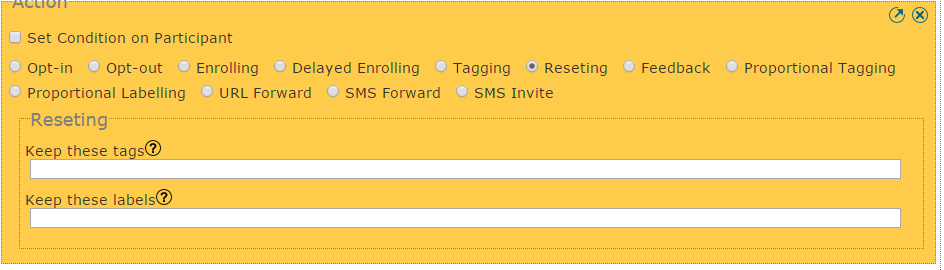
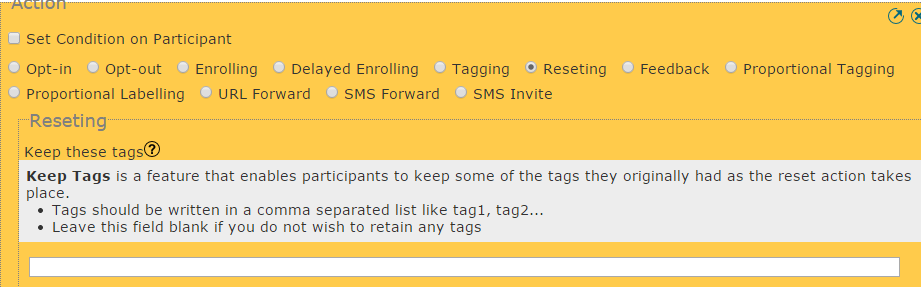
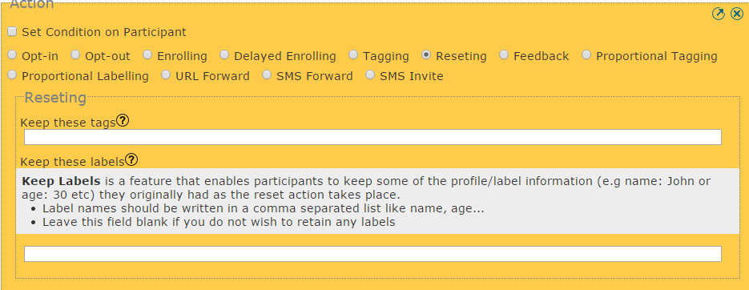

:index:`Reset Action with Excepitions`
++++++++++++++++++++++++++++++++++++++

In Vusion a reset action will opt-out a participant and opr-in the participant agian. This action willremove all tags and labels associated with this participant, essentially allowing this participant to start afresh, clean.
This is the default behaviour of the reset action, and will happen if the *keep-these tags* and *keep these labels* fields are left blank, as below.

However, it is possible to retain some tag(s) and/or label(s). Basically, retaining the tag(s) or label(s) can be useful in performing any number of actions on that participant, for example can be used to enroll the reset participant into a particiular dialogue based on the tag he retains.

To keep tags:

To keep labels:

