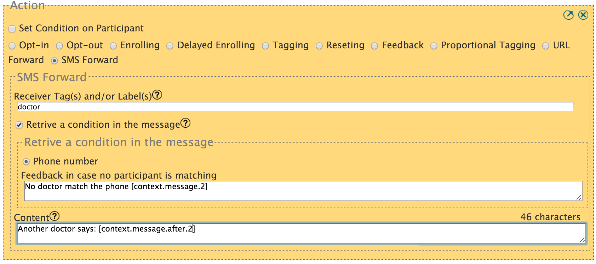

:index:`SMS forwarding`
########################

Use Case
----------
Consider following use case: An Organization is setting up a Alert and Rescue service. Participant can request help from the member of this organization simply by sending HELP to a shortcode.
The SMS will be automatically forwarded to different member of the organization who will then make sure someone in the neighborhood will visit urgently this participant. 

The drawing below show how this use case would work.

.. image:: _static/img/smsforwarding_use_case.jpg

**1 :** The participant sends out an Alert message.

**2 :** Vusion create a notification message to all participants who are tagged **Alert**. The message can be customized to include information from the participants, the time or even the Alert message content. 

**3 :** Tagged participants are receiving the notification message.

How To Set a SMS Forward
------------------------

Either in a Request or a Dialogue, you can select the action *SMS Forward* from the list of actions. Two fields appear as shown below:
 

* *Receiver Tag(s) or Label(s)* is a textbox, you enter the tags or labels that participant must match in order to receive the notification message. Please make sure that some partipants are currently opt-in and are tagged with this tag otherwise nobody will be notified.
* *Retrieve a condition in the message*, is a checkbox to indicate that some condition on who to forward this SMS are in the initial SMS itself.
  When checking this box, two more fields have to be defined:
	* *type of condition* for now, only "phone" is available
	* *feedback in case no participant is matching* which is a feedback message return to the send in case no participant is matching his condition.
* *Content* is this textarea, you enter the notification message that will be send. For more details on how to customize this message, see the next section.

:index:`Notification Message`
------------------------------

This is an example of notification message. 

In this example we assume that the send of the alert has been created on the program with 2 label:

#. name:Tom
#. address:3rd av behind city mall mombasa

So with this notification message content:
::
	"Alert [participant.name] ([participant.phone]) at [participant.address] say '[context.message]' at [time.H]:[time.M]"

will be customized as:
::
	"Alert Tom (+2567702222) at 3rd av behind city mall mombasa says 'Alert help' at 10:50"
	

Another example with more time elements:
::
	"Alert from [participant.name] at [time.H]:[time.M] on [time.d]/[time.m]"

will be customized as:
::
	"Alert from +2567702222 at 10:50 on the 09/04"

For more details on :doc:`Message Customisation </advanced/message_customisation>`
