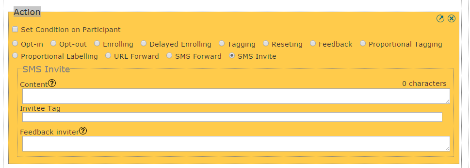

:index:`SMS invite action`
######################

Use Case
----------
Consider following use case: An Organization is setting up an HIV awareness service. Participant can request a friend to join the serivce simply by sending JOIN (friend's phone number) to a shortcode.
The friend will automatically be optin and receive an invitaton SMS.

How To Set a SMS Invite
------------------------

In either a Request or a Dialogue, you can select the action SMS Invite from the list of actions. Three fields appear as shown below:

   
* *Content* is this textarea, you enter the invitation message that will be sent. For more details on how to customize this message, see the next section.
* *Invitee Tag* is a textbox, you enter the tag which the invited participant will have to easily identify them in the participant index 
* *feedback in case participant is already Optin* which is a feedback message return to the sender in case participant is already Optin in the program.

.. note:: 
	When using sms invite action on Request ensure that *"In case no matching on other requests, try to match only the message first word."*
	checkbox is ticked.
	
	Also regarding the phone input on the invitee. The inviter (vusion participant) should add the international perfix to the invitee phone number when sending
	the KEYWORD ie
	              "JOIN +2561111" or "JOIN 256111111" or "JOIN 0256111111"
	              where "256" is the International Perfix for the country where the program is running.

:index:`Notification Message`
------------------------------

This is an example of invitation message. 

In this example we assume that the sender of the invitation has been created on the program with a label:

#. name:Tom

So with this invitation message content:
::
	"[participant.name] ([participant.phone]) as invited you to join the HIV awareness service"

will be customized as:
::
	"Tom (+2567702222) as invited you to join the HIV awareness service"

For more details on :doc:`Message Customisation </advanced/message_customisation>`
