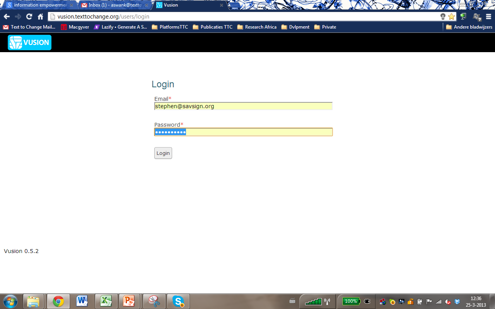
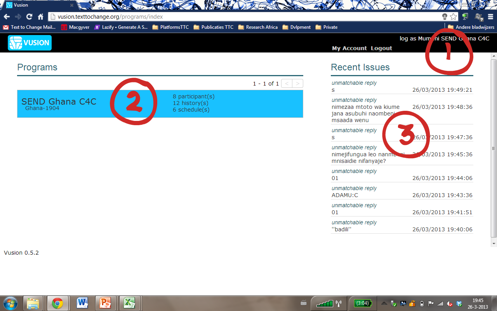
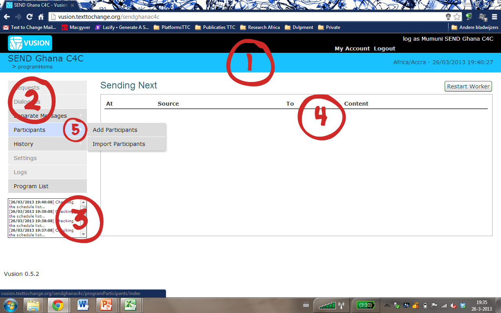

TTC Program Manager Vusion training C4C
+++++++++++++++++++++++++++++++++++++++

.. epigraph::

  *Information equals empowerment. Empowerment is critical to poverty eradication and development.*

  -- Wu Hongbo, UN Under-Secretary-General for Economic and Social Affairs; Sept. 2012

Context
--------

Configuring Vusion
------------------
Here we will cover the basic configuration of Vusion. Topics covered are understanding the Vusion dashboard, managing participants and scheduling messages. At the end of this section you will be able to send messages to groups of participants.

Log in
=======

This is the Vusion login screen. It can be reached by going to `http://vusion.texttochange.org <http://vusion.texttochange.org>`_. On this screen you can log in with the credentials recieved by your TTC Country Manager. This is a unique combination of an e-mail adress and password.

Program index
=============
.. figure:: _static/img/image19.png
	:width: 850px
	:align: center
	:alt: image19.png
	:figwidth: 850px

#. When you have succesfully logged in, you will be redirected to the program index page. First of all, note the black bar on the top of the screen. On the right of this bar, you can see your account name. To view or change your account settings you can click on My Account. In order to logout of Vusion, click on Logout and you will be redirected to the Login screen. 

#. Below the black bar on the left we can see the programs available to you. Programs are shown as a blue box. On the left of this blue box you can see the name of the program, the country the program is running in and the shortcode for the program. On the right of the box there are some statistics about the program. The number of participants, the number of messages sent and the number of scheduled messages are displayed here.

#. On the right side of the screen there is a list called Recent Issues. In this list the most recent issues that have turned up in the system are shown. Typically incoming messages that the system is unable to correctly process end up in this list. This is a good thing to look at when a program is not working correctly.

Program dashboard
===================

.. figure:: _static/img/image20.png
	:width: 850px
	:align: center
	:alt: image20.png

#. When you select a project, you are sent to the homepage of the program. From this page you can manage the program to perform the tasks you want. The first thin to notice is that underneath the black bar on the top of the screen, there is now a blue bar. This is the Program Bar. On the left side of this bar you can see the name of the project with between brackets the country the program is running in and the shortcode associated with the program. On the right the date and time for the location of the program.
#. In the left column under the Program Bar the Navigation Menu is located. This menu gives acces to all the different functions, features and tools Vusion has to offer. As you can see some of the options in the Navigation Menu are greyed out. This means these features are not currently available to your account. 
#. Under the Navigation Menu is a small box called the Live Log. This shows what the system is doing in real-time. 
#. To the right of the Navigation Menu, the send queue is visible. This shows all the messages that are in the queue to be sent. As you can see, at this moment it is empty. On the top right of the queue is the Restart Worker button, which manually starts a worker to handle all messages in the queue.
#. Before we can start sending messages we need to have participants in the program. To see, import and manage participants, click on Participants in the Navigation Menu.

Editing and configuring Dialogues in Vusion
-------------------------------------------

Designing an M4D campaign
-------------------------
