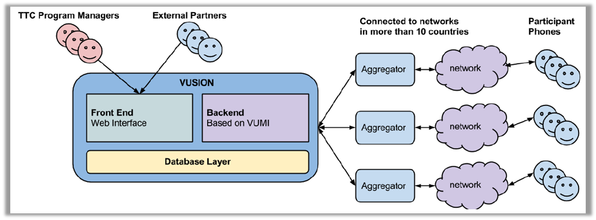

Vusion backend architecture
+++++++++++++++++++++++++++++++++++++++

This guide will explain the architecture of the Vusion system. In order to send a message from Vusion to the mobile phone of a participant, a lot of infrastructure is used. From the Vusion software running on a server the cloud through the mobile networks of our partners to the mobile phone of the participant, all parts are needed to succesfully deliver the message. 

Overview
-----------

The diagram below shows a schematic overview of the Vusion system and infrastructure. The Vusion infrastructure consists of two parts. On the left you can see the Vusion server with the Vusion software running on it. This is where the information about the program is stored. 
On the right of this you can see the aggregators and the networks. This section handles the transport of messages from the Vusion servers to the participants and back again. Participants are the people with cellphones who are reached by the programs ran by Text to Change.

	Schematic overview of the Vusion infrastructure. 

Vusion server
-----------------

First we will focus on the left side of the image: the Vusion server. The Vusion server is a software system that runs on a virtual server in the cloud. The software system performs a number of tasks.

Firstly it offers a website through which the program manager can set up programs. The program manager creates and configures the program.  Once the program is set up, he can keep track of the progress and collect the results, all through this web interface. An introduction to this web interface can be found here: :doc:`Vusion introduction<login>`

Secondly the Vusion software is designed to make it possible to send SMS messages to telephone numbers in the system. This is an central feature in the programs we execute. By sending messages, people can be reached. Vusion makes that possible. The messages can be sent because Vusion is connected to the mobile networks of telephone companies. The next section contains more information about the role of telephone companies.

Finally, besides sending messages the software is also capable of recieving messages. This means the content of recieved messages can be stored. What makes it special is that Vusion can not only store the recieved messages, but also interpret the content of the messages and react to this content. When a message is recieved containing a certain word, Vusion can perform a certain action. This gives the program manager the possibility to create complex interactions between Vusion and the participant. This way interactive programs are created. 

The Vusion server with the Vusion software on it is the brain of the system. It is the place where everything is controlled from, and where the decisions are made. 

.. note::
   **Security**

   As programs might contain important or sensitive data, the security of the Vusion system is very important. We have taken the nescessary steps to ensure that the Vusion system is properly secured. The system is hosted in a cloud located in a secured datacenter. This way of hosting ensures that even if one of the machines fails, the system will continue to run on a different machine. If this reduntant setup were to fail, your data is still not lost. The system creates a back-up daily that is encrypted and stored off-site. These backups are kept for three months. This will ensure that the data of your research will not be lost. 

   There are also measures in place to prevent unauthorized people accessing the data on the system. The Vusion software is designed with a number of user levels. According to your user level you have access to the right group of programs. All the other programs running on the system are safely hidden, and the data of these programs can not be accessed. This way we can ensure that no-one other then the people involved have access to the data. More information about the user levels can be found in the  :doc:`Understanding User Levels guide </advanced/understanding-user-levels>`. Finally Text to Change will never share project data without permission from the project owner.

Transport network
-------------------

In the previous section we talked about the Vusion software system. In this section we will cover how Vusion sends a text message that ends up at the phone of the right person.

To get the text messages from Vusion to the participants and back again, a transport network is used. Vusion is an SMS platform so all communication goes through the networks of mobile network operators. In each country a number of those mobile network operators are active. Some well-known ones across Africa are:

========    ==========
Orange      Airtel
Vodacom     Vodafone
MTN         Tigo
========    ==========

There are many more of these companies. The role of the mobile network operators is that they have a network of GSM base stations all over the country. They connect cellphones to the network so users can send and recieve SMS messages and telephone calls. Normally these mobile operators send and recieve messages to and from the networks of other telephone companies. By making deals with these telephone companies, Vusion is also connected to these networks. This means that Vusion is capable of sending and recieving text messages through the connected networks. 

This may sound easy, but there are a number of issues that make it a little complex. 

In almost every country there are many mobile network operators, each with their own network of base stations. Mobile phones are connected to these networks. One of the problems we face is that not all phones connect to all networks. For example if someone has an Orange phone, it only connects to the Orange mobile network. This means that If we want to communicate with that person, we need to make a deal with Orange. If we want to be able to connect to all users, we need to make deals with all the mobile network operators active in a country. This can be a very time-consuming process, but luckily there is a solution: Aggregators.

An aggregator is a local company that has a connection with some or all mobile network operators in the country. Making a deal with an aggregator gives us access to multiple mobile networks at once. This way we are able to reach more people with our programs.

.. note::
	**Shortcodes**

	Normally mobile phone numbers are around 10 digits long. This is too long for people to remember quickly. In a lot of campaigns people can text a certain word to a telephone number to recieve information or to join a program. If they have to remember a very long number this does not work. To solve this problem, mobile network operators offer a service called **shortcode**. A shortcode is a special, short telephone number that can be assigned to a service. It is usually 4 or 5 digits long, which means it is easy for people to remember. 
	When someone sends a text to a shortcode, the message is forwarded to the destination that the shortcode is registered to. In our case, Vusion. 

