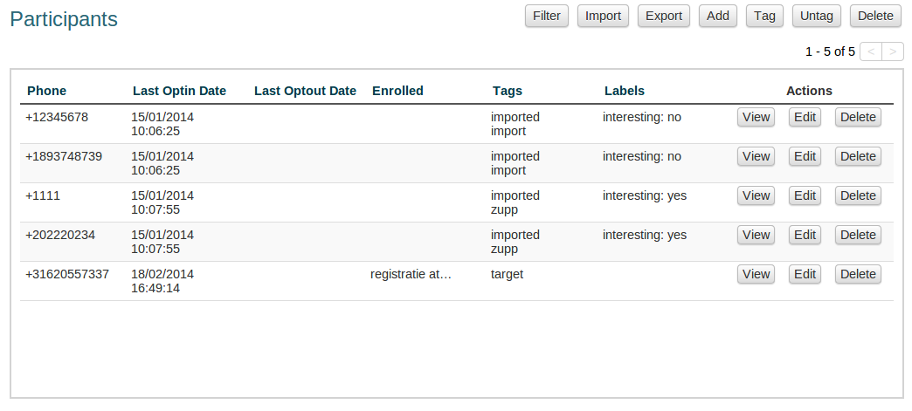
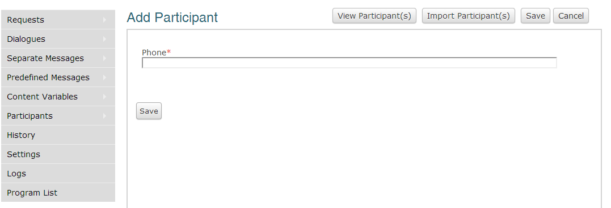
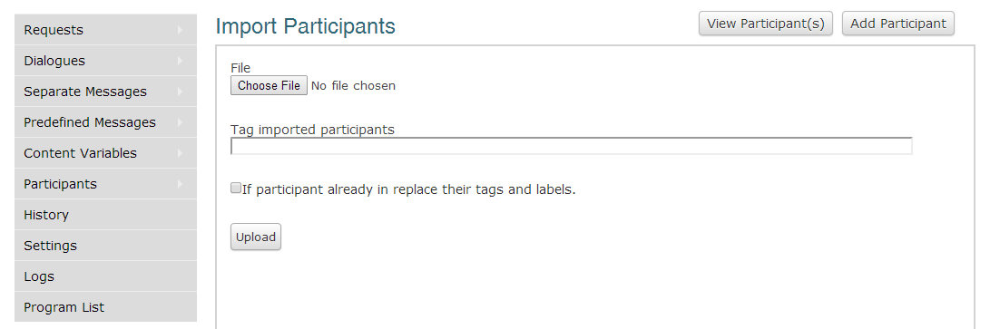
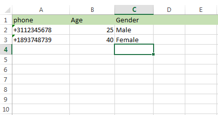
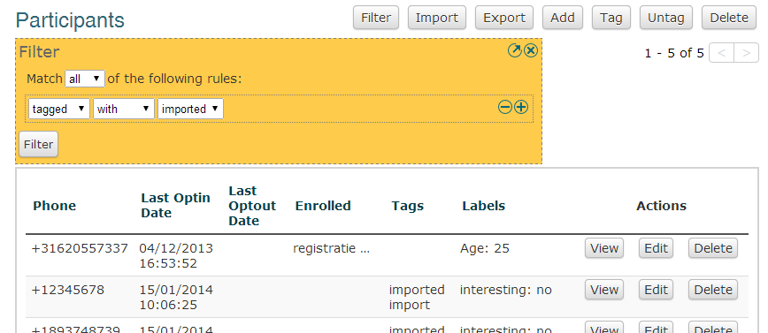

Participant management
+++++++++++++++++++++++++++
This section covers participant management in Vusion. Managing your participants efficiently can be very important, especially in programs with a large number of participants. Vusion has a number of tools available to help you in the various tasks you might need to perform. 

Participants are a very important part of the Vusion system. A participant is identified by his or her cellphone number. In the Vusion database, more information can be added to the participant record, such as the date the participant was added to the database, dialogues the participant is enrolled in and various tags and labels containing additional information about the participant. All this information together can create a fairly extensive profile of a participant. This information can later be exported and used for analysis.

	The Vusion participants screen 

Adding participants
----------------------------

One of the first and most basic tasks when you start using Vusion is adding participants to the Vusion database. In order to send a message you need to have at least one participant in your database. 

Adding a single participant
================================
In order to add a participant click on the Add button. 

	The Vusion add participant screen 

Now you will see a screen where you can enter a phone number. Enter the phone number of the participant you want to add and click Save. Congratulations, you have added a participant. Now this participant will show up in the Participants screen.

Importing participants from a file
=====================================
In many cases adding participants one by one is not very efficient. Luckily there is another way of adding participants and that is by importing them from a file. Using the Import button the Import Participants screen is reached. Here you can choose a file from which Vusion will import the contacts. 

	The import participants screen 

You can import from a CSV or XLS file. The first column should contain the telephone numbers. The second column is reserved for tags.  Other columns in the file will be seen as labels for the participants, where the top entry of each column will be used as the label name.

	The first entry in the first column, field A1 in Excel, should always contain the text "phone". The next column contains tags. Other columns can contain Labels for the participants

In the Import Participants screen you can also automatically add a tag to the imported participants. Put the tag you want to add to the participants in the "Tag imported participants" field. When you selected the right file and the tag you want to add, click upload. The file will be uploaded and the participants will be added to the database with correct tags attached. 

Managing participants
----------------------

Managing your participants can be done in two ways. If you need to make a change to a single participant, or maybe just a few, you can manage them individually. You can also perform actions on groups of participants by first selecting the right group and then performing the action on the whole group.

Managing individual participants
================================
There are cases when yo need to perform an action on an individual participant. You can View, Edit or Delete individual participants with the buttons shown on the right of each participant. 

- The **View** button will bring up a page that shows details about the participant. It will show basic information like the participant's phone number, labels and tags but it also shows the participant's history. Here you can see records of all the communication between Vusion and the participant. It also shows options to Edit or Delete the participant
- The **Edit** button brings up a screen where you can change information about the participant. Things you can change here are: Phone number, Labels, Tags and the Dialogues the participant is enrolled in. 
- The Delete button will delete the participant from the database, including the participant history. This action is permanent and can not be undone, so be careful.

Filtering participants
===============================
When actions need to be applied to larger groups of participants, the controls on the top make handling large groups easy. Actions you can perform on groups of participants are: Export, Tag, Untag and Delete. Before you can perform an action on a group of participants, the first thing to do is to select the group you want to perform the action on. It is very important to select the right group, otherwise things can easily go wrong. Selecting the group is done using the Filter button. 

When you click the Filter button, a big yellow box pops up. 

	This is the Filter interface. 

In the filter interface, you can create filters to select records with certain information. For example: as we said before, all participants imported from a file are automatically tagged with the tag: **imported**. Using Filter we can select participants with this tag. To create a filter that selects all participants with the **imported** tag, first click on Filter. You now see the yellow Filter box. The first line with the options "all" and "any" are not relevant for now. We'll come back to that later. For now, click on the empty dropdown box and select "tagged". Now two extra boxes show up. These three boxes make up a filter rule. To select all participants tagged with "imported", select a filter with::
	
	tagged | with | imported

Now click Filter. The page will reload and show all records of participants with the tag "imported". Using this same method you can filter on a number of other characteristics. At the moment you can filter on:
 - **phone**: filter on phone number.
 - **optin**: filter on opt-in date.
 - **optout**: filter on opt-out date.
 - **enrolled**: filter on the Dialogues participants are enrolled in.
 - **tagged**: filter on participants' tags.
 - **labels**: filter on labels participants have.

When you select the property you want to filter on, appropriate boxes will appear next to the first box to further specify your filter. 
The example above shows how to use a filter to make a selection. Most of the times one filter rule will be enough to select what you need, but sometimes you need more complex filters. In Vusion it is possible to create more then one filter rule by simply clicking on the "+" symbol on the right of the Filter box. This will generate another line where you can enter another filter rule. This is also where the difference between "all" and "any" on the first line of the Filter box becomes important. 

Suppose you have two filter rules, rule A and rule B and the filter is set to "Match all". Now only records are allowed that match rule A **AND** rule B. Now when the filter is set to "Match any", all records are selected that match either rule A **OR** rule B. In other words, when "all" is selected, **both** rules have to be met, and when "any" is selected, **at least one** rule has to be met. 

In Vusion it is possible to create filters with multiple filter rules. When working with multiple filter rules, it is very important to understand the difference between matching "all" or "any" filter rules.

For a closer look at the filtering options in Vusion, please refer to the :doc:`History Filtering guide <filtering-history>`

Performing actions on groups of participants
=============================================
When you have made the right selection, you can perform actions on all participants in the selection. The actions that are available are:

 - **Tag**: Add a Tag to all selected participants. A tag is a piece of text that can be used to mark certain participants.
 - **Untag**: Remove a Tag from all selected participants.
 - **Export**: Download a CSV file to your computer containing the selected participants. The file will contain all the details of the participant like tags and labels. This guide will show you how you can use the CSV file in Excel :doc:`Mini guide: Using .CSV files in Excel </advanced/csv_split>`
 - **Delete**: Remove the selected participants from the database. When you delete participants they are permanently removed. This action can not be undone.

It is very important to remember that these operations work on all the currently selected participants. This means you have to be very careful, especially when deleting groups of participants. 

