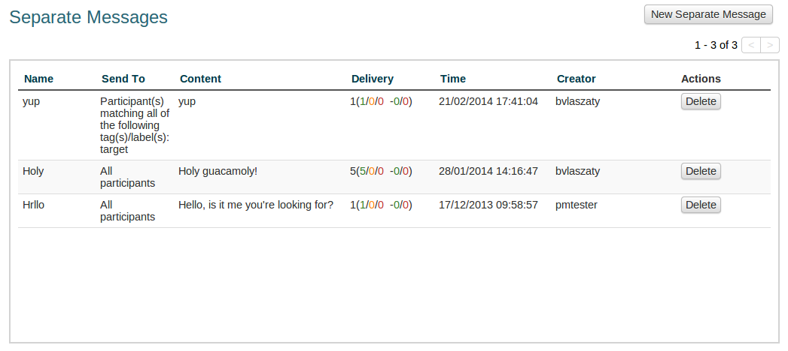
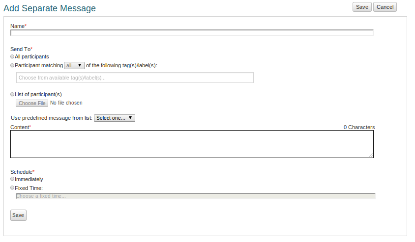
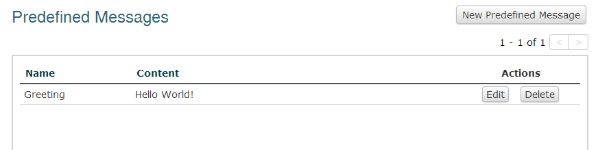
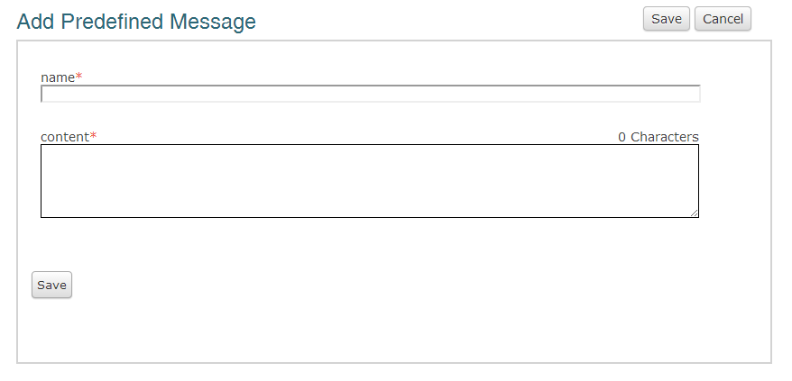

Seperate messages and predefined messages
++++++++++++++++++++++++++++++++++++++++++++

Sending a message to a group of people in Vusion is easy. This guide will explain how you can send a single message to a group of people. This type of messaging is used when no interaction with the participant is required.

:index:`Seperate messages`
============================

In the program menu there is a menu item called Seperate Messages. This will bring you to the Seperate messages screen. 

In this screen you can see a list of previously sent Seperate Messages with some details about them. The list also shows the scheduled messages. These are messages that are created and are ready to be sent at some moment in the future. If messages are scheduled but not sent yet, you can still change the message. To do that, click the Edit button on the right of the message. 

There is also the possibility to delete a Seperate Message. If the message has not yet been sent, the message will be removed from the schedule. If the message has already been sent, deleting it will delete the record of the message in Vusion.

.. note::
	Most characteristics of the messages are self-explanatory. The Time shows the time the message was created for instance. One thing that is not so straightforward is the Delivery column. In this column you will see six numbers, of which the exact meaning is not immediately clear. These numbers represent the status of the delivery of messages. These are some very technical details that are also closely linked to the way messages are sent in Vusion. Let me try to explain. Imagine that there is a message with this delivery status: **6 (5/4/3 -2/1)**

	- 6: The total number of messages sent

	- 5: *(delivered)* The number of messages for which a confirmation of delivery has been received from the operator.
	- 4: *(pending)* The number of messages that are still in the queue within Vusion.
	- 3: *(failed)* The number of messages gor which delivery has failed, based on reports from the operator.

	- 2: *(Ack)* Messages that have been sent to the operators and of which the operators have confirmed that they received the message.
	- 1: *(Nack)* Messages that have been sent to the operator but the operator has not yet confirmed that the message was received.
	
	Details like these can help troubleshoot when there are issues concerning connectivity or messages not reaching the participant. 

Sending a seperate message is easy: in the Seperate Messages screen, click on New Seperate Message. This will bring you to the Add Seperate Message screen. 

In this screen you can define a Seperate Message. Creating a Seperate message requires you to enter 4 characteristics.

 - **Name**

   Here you can enter a Name you want to give to this particular Seperate Message. Use this name to recognise the message. If you are inviting people to an event, you could give it a name like: *Invitation Januari Meeting*.

 - **Send To**

   Send To defines who will recieve the message. Here ther are 3 options

	 - **All participants:** Send the message to all participants in the program.
	 - **Participant matching:** This option works similar to the participant filter option [Reference to the filter part of the participant management guide]. Here you can select one or more characteristics for the participants. Participants who match those characteristics will recieve the message. [More explanation needed?]
	 - **List of participants:** Use telephone numbers from a file to send the message to. Click on Choose File to select a file.

 - **Content**

   The content of the message is the message that the selected participants will recieve. You can use a previously defined message by selecting one from the dropdown menu. This will enter the content of the predefined message in the Content box. Creating a predefined message is described below.

   You can also simply type the message you want to send out into the content box. 

 - **Schedule**

   Schedule sets the moment that you want Vusion to send the message. You can let Vusion do it right away, or schedule the message to be sent out at some point in the future. To schedule a message, select Fixed Time, and click on the text box. A selector will pop up to help you correctly set the time and date.

   .. note:: 
      The date and time selector works by setting the absolute date and time, not the relative date and time. The time you enter is the time of day that the message will be sent out. 

Once These things are set, click Save to save the message you created. If you scheduled the message to be sent immediately it will now be sent. If you scheduled the message to be sent somewhere in the future, it will be saved and sent at that time. In this case you will still be able to make adjustments to your message.

:index:`Predefined Messages`
===============================

In the program menu under Seperate Messages there is a menu item called Predefined Messages. In this screen you can define and save a message that you can later use as for instance a seperate message. This can be useful if you have to send the same message multiple times. 

When you click on Predefined Messages in the Program Menu, the Predefined Messages screen is shown. 

Here see a list of the currently available messages. By clicking the Edit button you can change a Predefined Message. Clicking the Delete button will delete the message.

To create a Predefined Message click the New Predefined Message button. This will give you a screen where you can define a message. 

This screen is very simple. It has two text boxes. In the first text box you can enter a name for the Predefined Message. Use a name that will make it easy to recognise the message. Then there is a box where you can enter the content of the message. This is the text that will eventually be sent to participants. 

Clicking the Save button will save your Predefined Message so you can use it at some later time. 
