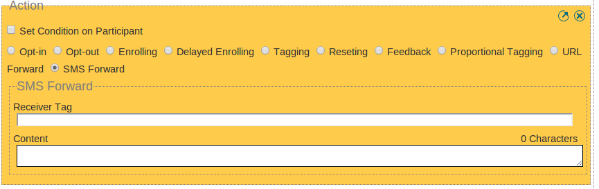
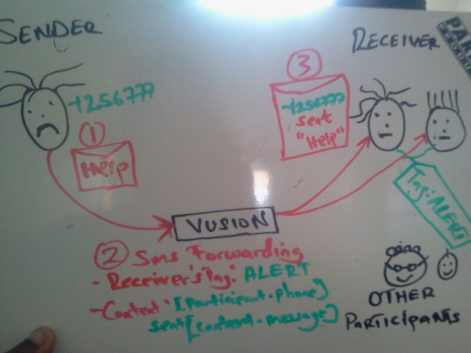

Sms forwarding
##############
When selecting action sms forward radio button from the list of actions. An interface comes up with two fields as shown below:
 

**Receiver Tag:** 
In this textbox you enter the tag for participant in your program who are meant to receive the Alert message.

**Content:** 
In this textarea you enter the message format the tagged participants will receive when an alert is sent by participant.

ie
----

"Hello **[participant.name]** (**[participant.phone]**) at **[participant.address]** say **[context.message]** at **[time.H]**:**[time.M]**"

**[participant.name]**      will show the name of the participant sending the Alert message.

**[participant.phone]**     will show the phone number of the participant sending the Alert message.
     
     
**[participant.address]**   will show the address of the participant sending the Alert message.
     
     
**[context.message]**       will show the message context sent by the participant.
     
     
**[time.H]**                will show the hour the participant sent the Alert message.
     
     
**[time.M]**                will show the minutes the participant sent the Alert message.

if participant sent "Alert help" where "Alert" is the keyword. The participant tagged to receive this message will reveive the message below 
**"Hello Tom (+2567702222) at kkkl says help at 10:50"**
     
consider the use case  in the image  below:

**1 :** Participant sends out an Alert message 

**2 :** Vusion formats  the message according to the dynamic contnent provided 

**3 :** tagged participant receive the message and respond to it.

