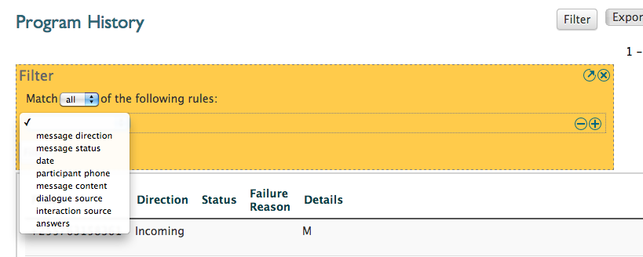
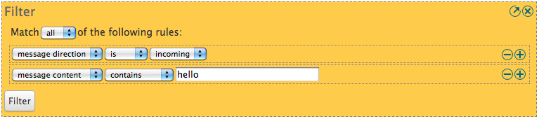
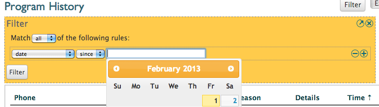
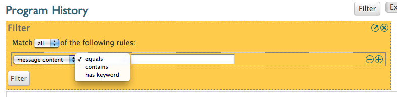
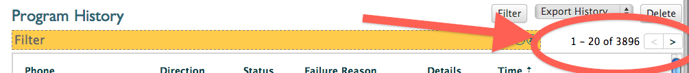

Filtering History
#################

The program history provides some powerful filtering tools. Start by going to the history page of a program and clicking on the filter button at the top right of the screen. This will give you yellow block in which you can start defining your filter. 

The following image shows the filter box and the drop down with all the various filters that can be used:

From this we can start defining out filter. But let us first look more closely  at the filter screen and see what options we have for filtering.

Matching all or any filter rules
################################

The first thing we note is that on the top we can choose between:

* *match* **all** *of the following rules*
* *match* **any** *of the following rules*

If we match **all** the rules, the messages that will show up after filtering meet **all** the conditions you have definied in the filter. So, if you said you want to filter incoming messages and messages containing the word *hello*, the messages shown will be only the messages that are both incoming **and** have the word *hello* in them. Not incoming messages **not** containing the word hello will be shown.

If we match **any** of the rules it works different. Suppose we want to filter on messages containing the word *hello* or messages containing the word *bye*. We would then say we want to match any of the rules, and define described filters. The end result will be a list of all messages containing the word *hello* and all the messages containing the word *bye*.

If this is still confusing, think about it this way. If we use the *all* rule we will basically say that each row of the filter has **AND** written in between. Because the resulting list of messages will have to match the first filter **AND** the second filter, **AND** the third filter, etc. When we use *any* the **AND** is replaced by **OR**. 

Defining a filter rule
######################

Once we decided if we want to match *all* or *any* of the filters we can start defining our filter rules.

First we select the type of the filter. The following types are currently available:

* *message direction* - filter on either incoming or outgoing messages
* *message status* - filter on the status of the message
* *date* - filter on the dates messages were sent/received
* *participant phone* - filter on phone number (or part of it)
* *message content* - filter on any of the words or strings in the message content
* *dialogue source* - filter on messages that relate to a specific dialogue
* *interaction source* - filter on messages pertaining to a specific interaction
* *answers* - filter on matching or unmatching answers to questions

Once we have chosen the type of filter we want to use there are a few different options.

For some filters a second drop down box will appear which enables us to choose various options for the filter. For example, if we choose the filter *message direction*, a second drop down box will appear that enables us to choose between incoming or outgoing messages.

For other filters there will be a third box were we can provide additional details. The date filter is a good example. When we choose date we get a second drop down to choose between *until* and *since*, however, a third box is also presented were we can put the actual date from which we want to filter.

Another example is the message content filter:

We can choose between three options in the second drop down and the textbox gives us the possibility to write a word or string on which VUSION will do matching.

We can add more rules by pressing the **+** button at the right of a filter rule. This will give us another line on which to define an additional filter. Conversely, filter rules can be removed by pressing the **-** button at the side of a filter rule.

Getting filter results
######################

Once all the rules have been defined you can press the *Filter* button underneath the rules to start filtering. After a little wait the matching messages will appear.

You can go through all the messages by scrolling and using the arrow buttons to the side of the filter. This is also were you can see how many messages are matching your filter:

If the filter did not give the intended results you can click the small arrow button on the right side of the yellow filter box to start editing the filter and try it again with different parameters.

It is important to note that once you have defined a filter you can easily save it by storing the URL as a bookmark. Then, by going to the same URL you will get the same filter again. This is an easy way of revisiting past filters.

Also, you can export the filtered data by using the **Export History** dropdown at the top right of the screen. By exporting you can do further analysis on the data in an external application, like Microsoft Excel.

