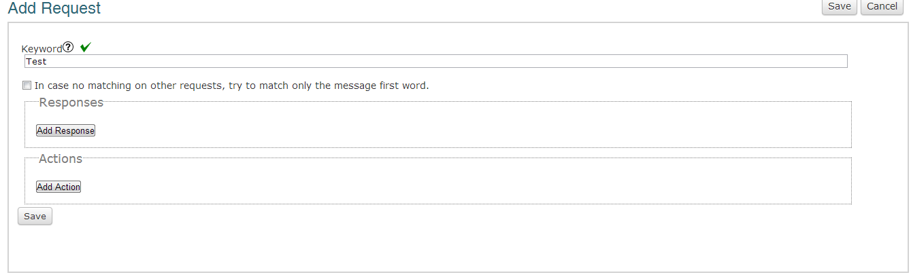
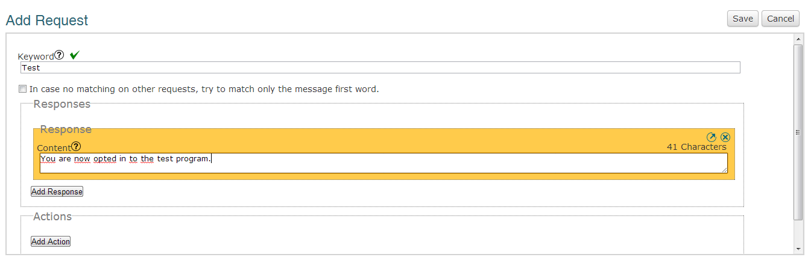
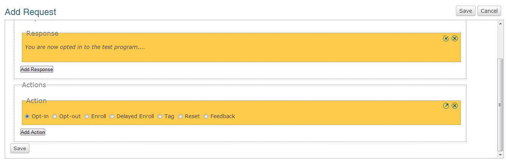

Requests
#########################

General
=================

A request will enable participants to interact with Vusion. The most important part of a request is the keyword.
This will allow the system to know about what the participant is texting and respond with an appropiate answer/action.
The green sign means that the keyword is not in use yet, if a red cross appears it is in use by another programm. You will need to choose another keyword.

The checkbox that says *'In case no matching on other requests, try to match only the message first word.'* should always be checked.
This makes sure that even if a participant does not reply the keyword but something that looks like it, he/she will get a reply in stead of an error.
In practice this means that when an user sends INFO instead of INFO 1 it will match to INFO 1. The full match will always get priority over the partial match, so INFO 1 will be matched to INFO 1 and not to INFO.

Example:

Request: INFO

Box checked: no

User sends: INFO 1

**Vusion won't match** 

Request: INFO

Box checked: yes

User sends: Info want info yes

**Vusion will match to INFO**

Request 1: INFO 1

Request 2: INFO

Box checked: yes

User sends: INFO 1 > **Only request 1 will match**

User sends: INFO 2 > **Only request 2 will match**

A response is what the person who texted the keyword to the shortcode will receive immediately after texting.
Responses should not exceed the 160 character limit of a text message. 

When you have designed the response you can add an action to the request. This is something that will happen
when someone texts the keyword to the shortcode.

It is important to note that **all** participants will need to be opted in in order to be able to participate in the program.
Also note that the action enroll automatically opts the participant in as well. So there is no need to opt a participant in first and then enroll him in a diaologue.

Once all this is done, safe your request.

Actions
=====================

=======================  ========================= 
Action                    Explanation
-----------------------  -------------------------
**Opt in**                                  
-----------------------  ------------------------- 
**Opt out**               Participants will no longer be able to receive messages                           
-----------------------  ------------------------- 
**Enroll**                Enroll participants in a certain dialogue                  
-----------------------  ------------------------- 
**Delayed enroll**        Enroll participants in a certain dialogue after a certain amount of time                      
-----------------------  ------------------------- 
**Tag**                   Apply a tag to the user that texts this keyword                      
-----------------------  ------------------------- 
**Reset**                                         
-----------------------  ------------------------- 
**Feedback**                                         
=======================  ========================= 