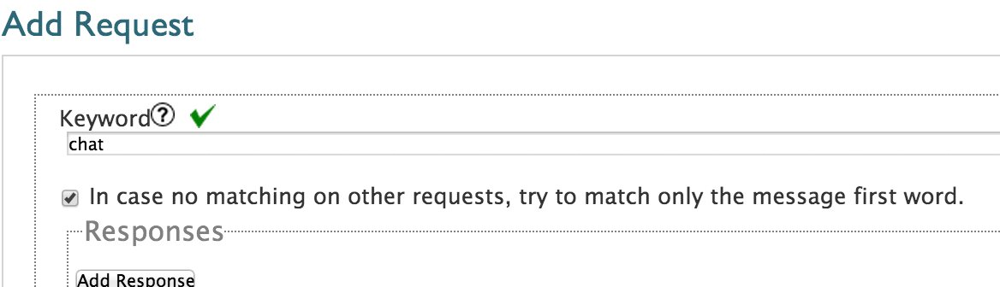

Chatroom style program
=======================

In a chatroom style program, Participants can exchange message within a group of participant. To represent the group, one has to use TAGs or LABELs. In a chatroom by Tag program, one is using TAGs to define groups. Once the group is defined participants having the same tag can send messages to each other 
For example; we have a set of participant who are all tagged CHATROOM.  When one of those participants send “CHAT HELLO, the participants tagged with the receiver tag “CHATROOM” will receive **“+256772111111 sent Chat Hi”.**
**TIP: Chatroom by Tag is a basic chatroom setup which can be used for a small number of groups. In order to manage multiple groups, one should consider using Chatroom by Labels.**

.. WARNING::
	Such a program can potentially generate very many SMS. 
	A group of 5 people all sending 1 message will generate 25 SMS *= 5 participant sending x 1 message x (1 initial messages + 4 participant receiving)*.
	For 10 people all sending 5 SMS will generate 500 SMS *= 10 participant sending x 5 messages x (1 initial messages + 9 participant receiving)*. 
	More people will make the figures explode and partners might not realize this. 

    Good practice would be set an SMS limit in the program settings to avoid bad surprises.

How to create a chatroom by tag
--------------------------------
To implement a chatroom by tag program,  user rely on only one Vusion Request with an Action SMS FORWARDING.  Find below the step by step implementation of the description example.

**1 :** Go to Requests and create a new request.

**2 :** Create the keyword that will be used to chat. Also tick the box "In case no matching..." in order for all receiving messages with the keyword "CHAT" to trigger this request.  

**3 :** Add an action SMS Forward

**4 :** Receiver tag: In this textbox, you enter the tag of participant to will receive the message. make sure that some participants are currently opt-in and are tagged with this tag(CHATROOM) otherwise nobody will be notified

**5 :** Content: In this textarea, you enter the notification message that will be sent, the notification message would be **“[participant.phone]** sent **[context.message]**

**[participant.phone]** will show the phone number of the participant sending the message
**[context.message]** will show the message context sent by the participant

**6 :** Save and exit

