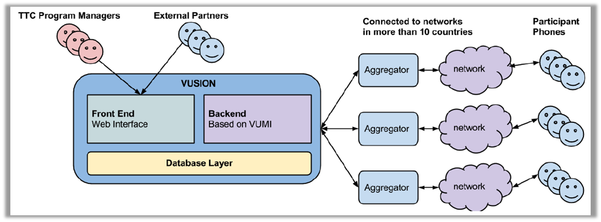

Vusion backend architecture
+++++++++++++++++++++++++++++++++++++++

This guide will explain the architecture of the Vusion system. In order to send a message from Vusion to the mobile phone of a participant, a lot of infrastructure is used. From the Vusion software running on a server in a datacenter through the mobile networks of our partners and finally to the mobile phone of the participant, all parts are needed to succesfully deliver the message. 

Overview
-----------

The diagram below shows a schematic overview of the Vusion system and infrastructure. The Vusion infrastructure consists of 3 parts. On the left you can see the Vusion software running on our servers. This is where the information about the program is stored. On the right of this you can see the aggregators and the networks. This section handles the transport of messages to and from the Vusion servers. Finally all the way to the right, the participants are shown. These are people who have cellphones and are involved in the system by sending or recieving messages. 

	Schematic overview of the Vusion infrastructure. 

Vusion server
-----------------

The Vusion server is a software system that runs on a large server. It offers a website through which users can configure what the system should do and how the system should react to certain events. The Vusion software is designed to make it possible to send SMS messages to telephone numbers in the system. This means the system can quickly send SMS messages to very large groups of people. 

Besides sending the software is also capable of recieving messages, and interpreting them. This means the content of recieved messages can be stored, but also that Vusion can react to certain content in the SMS message. The system can be configured to automatically send a reply when a message is recieved for example. It is also possible to assign certain labels to incoming messages or to users sending messages to Vusion. These functions help to keep track of users within the system, and using these features it becomes possible to build information systems in Vusion.

The Vusion website offers program administrators the possibility to design and execute an SMS program. By designing a set of actions and reactions to incoming messages a program is created. 
Program administrators can also manage the participants in the program. They can for instance import telephone numbers of participants to use in the program and export recieved messages and statistics.

The Vusion server with the Vusion software on it is the brain of the system. It is the place where everything is controlled from, and where the decisions are made. 

Transport nework
-------------------

-networks
-aggregators
-shortcodes

Participants
---------------

-
-send or recieve
-scenario's
