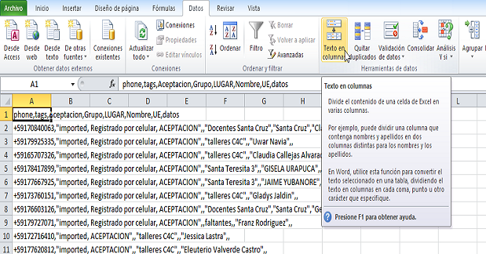

Usando archivos .CSV en Excel
------------------------------

Está guía cubre el uso de archivos .CSV en Excel. Vusion exporta sus archivos con la información de participantes y otros tipos de información en un formato llamado .CSV , esto viene de Comma Seperated Value (valor separado por coma). En un archivo CSV existen líneas de valores separados por comas. La primera línea del archivo consiste en los nombres de las columnas.

Estos archivos pueden ser abiertos en Excel. Sin embargo, cuando se hace esto Excel no abrirá o procesará los datos correctamente. En lugar de ello se verá algo así:

.. figure:: _static/img/csv_import.PNG
   :width: 400px
   :align: center
   :alt: image19.png
   :figwidth: 800px

Para poder analizarlos necesitará hacer un paso adicional. Como puede ver, el texto separado por las comas necesita estar en diferentes columnas. Existe una función en Excel que puede hacer esto. Esta función se llama Texto en Columnas:

Haciendo click en esta función paracerá un cuadro. Es importante seleccionar la manera correcta de dividir el texto. Necesita dividir el texto *delimitados* por *coma*

Si lo hizo correctamente el archivo deberá verse así:

.. figure:: _static/img/csv_result.PNG
   :width: 400px
   :align: center
   :alt: image19.png
   :figwidth: 600px

¡Felicitaciones, ha exportado su archivo .CSVC a Excel exitosamente!