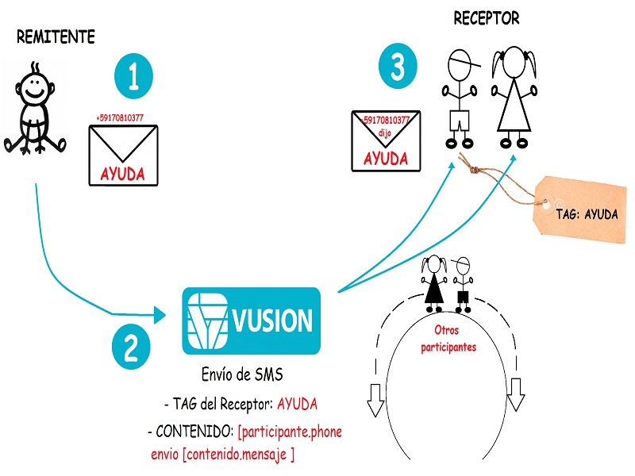
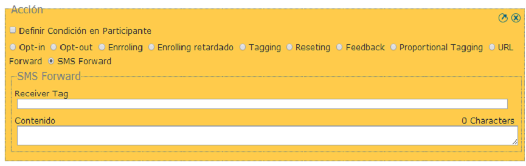

Envío de SMS
#############

Caso de Uso
------------
Considere el siguiente caso práctico: Una Organización está configurando un servicio de Alerta and Rescate. El participante puede solicitar ayuda a la organización simplemente al enviar la palabra AYUDA al código corto.
El SMS será automáticamente reenviado a diferentes miembros de la organización, los cuales se aseguraran de que alguien en le vecindario se aproxime inmediatamente al participante.

El siguiente dibujo muestra como funiconaría este ejmplo.

**1 :** El participante envía un mensaje de Alerta.

**2 :** Vusion crea un mensaje de notificación para todos los participantes que tengan la etiqueta (tag) **Alerta**. El mensaje puede ser personalizado para incluir información de los participantes,el tiempo o incluso el contenido del mensaje de alerta.

**3 :** Los participantes con la Etiqueta (Tag) recibirán un mensaje de notificación.

Como Configurar el Envío de un SMS
-----------------------------------

Ya sea en una Solicitud o un Diálogo, puede seleccionar la acción *SMS Forward* de la lista de acciones. Dos campos aparecerán como se muestra debajo:
 

**Receiver Tag:** 
En este recuadro para escribir, escriba el tag (etiqueta) de los participantes a los cuales les quiere enviar el mensaje. Por favor asegurese que algunos de los participantes ya estén registrados y con el tag que escribió sino nadie será notificado.

**Contenido:** 
En este recuadro para escribir, escriba el mensaje que quiera enviar. Para más detalles en cuanto a como personalizar el mensaje, vea la siguiente sección.

Mensaje de Notificación
------------------------

Este es un ejemplo de mensaje de notificación, en el cual asumiremos que el envío de alerta fue creado en el programa con 2 etiquetas (labels):

#. nombre:Juan
#. dirección:2do anillo diagonal al Cristo

Entonces este mensaje de notificación contiene:

"Alerta **[participant.nombre]** (**[participant.phone]**) en **[participant.dirección]** dice '**[context.message]**' a las **[time.H]**:**[time.M]**"

* **[participant.name]**      mostrará el nombre del participante que envía el mensaje de Alerta.
* **[participant.phone]**     mostrará el número de teléfono del participante que envía el mensaje de Alerta.
* **[participant.address]**   mostrará la dirección participante que envía el mensaje de Alerta.
* **[context.message]**       mostrará el mensaje de Alerta enviado por el participante.
* **[time.H]**                mostrará la hora en que el participante envió el mensaje de Alerta.
* **[time.M]**                mostrará el minuto en que el participante envió el mensaje de Alerta.

si el participante envía "Alerta de ayuda" donde "Alerta" es la palabra clave. El participante con el tag para recibir este mensaje recibirá el siguiente mensaje:
**"Alerta Juan (+2567702222) en 2do anillo diagonal al Cristo dice 'Alerta de ayuda' a las 10:50"**
