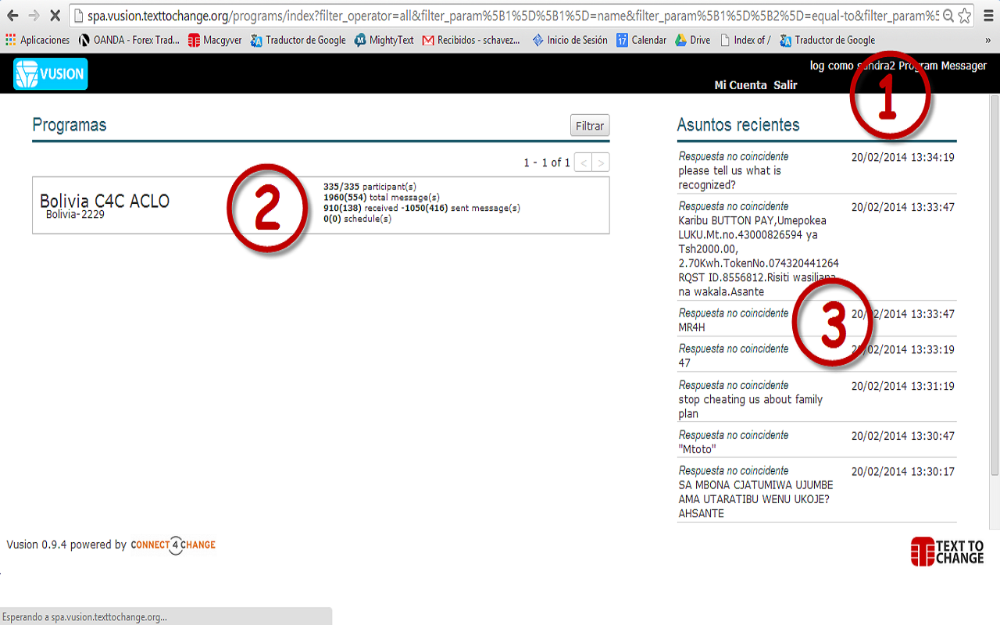

Entrenamiento C4C para Administrador de Programa Vusion TTC 
++++++++++++++++++++++++++++++++++++++++++++++++++++++++++++

.. epigraph::

  *Información equivale a empoderamiento. El empoderamiento es crítico para la eradicación de la pobreza y el desarrollo.*

  -- Wu Hongbo, UN Under-Secretary-General for Economic and Social Affairs; Sept. 2012

Contexto
---------

Configurando Vusion
--------------------
Acá cubriremos la configuración básica de Vusion. Los tópicos cubiertos son: Menú de Inicio de Vusion, administración de participantes y programación de mensajes. Para el final de esta sección podrá enviar mensajes a grupos de participantes.

Inicio de Sesión
=================
.. figure:: _static/img/image18.png
	:width: 850px
	:figclass: align-center
	:figwidth: 850px

Esta es la pantalla de inicio de Vusion. Puede acceder a ella dirigiendose a  `http://spa.vusion.texttochange.org <http://vusion.texttochange.org>`_. En esta pantalla puede iniciar sesión con las credenciales que recibió del Gerente de Programas de TTC de su país. Esta es una combinación única de dirección de e-mail y contraseña.

Índice del Programa
====================
.. figure:: _static/img/image19.png
	:width: 850px
	:align: center
	:alt: image19.png
	:figwidth: 850px

#. Cuando haya iniciado sesión exitosamente será redirigido a la página del índice del Programa. Primero note la barra negra en la parte superior de la pantalla. En la parte derecha de esta barra, podrá ver el nombre de su cuenta. Para ver o cambiar la configuración de su cuenta puede hacer click en *Mi Cuenta*. Para cerrar su sesión de Vusion, haga click en *Salir* y será redirigido a la pantalla de Inicio de Sesión. 

#. Debajo de la barra negra en la aprte izquierda podrá ver los programas disponibles para usted. Los Programas se muestran en un recuadro cada uno. En la parte izquierda del recuadro podrá ver el nombre del programa, el país en el cual se está llevando a cabo el programa y el código corto del programa. En la parte derecha del recuadro encontrará algunas estadísticas del programa. El número de participantes, número de mensajes enviados y número de mensajes programados se muestran ahí.

#. En la parte derecha de la pantalla hay una lista con el nombre Asuntos Recientes. En esta lista podrá ver los asuntos más recientes ocurridos en el sistema. Tipicamente los mensajes entrantes que el sistema no puede procesar correctamente terminan en esta lista. Esta es una buena herramienta a considerar cuando el programa no está funcionando correctamente. 

Menú del Programa
==================

.. figure:: _static/img/image20.png
	:width: 850px
	:align: center
	:alt: image20.png

.. figure:: _static/img/image20mockup.png
   :width: 850px
   :align: center
   :alt: image20m.png

#. Cuando selecciona un proyecto, es enviado a la página principal del programa. De esta página puede gestionar las funciones que quiere que el programa realice. Lo primero a notar es que debajo de la barra negra en la parte superior de la pantalla podrá encontrar ahora una barra azul. Esta es la Barra del Programa. En la parte izquierda de esta barra podrá ver el nombre del proyecto, entre paréntesis encontrará el país en el cual el programa está funcionando y el código corto asociado al programa. En la parte derecha la fecha y hora del programa.
#. En la columna izquierda debajo de la Barra del Programa se encuentra el Menú de Navegación. Este menú es el acceso a todas las diferentes funciones, características y herramientas que Vusion tiene para ofrecer. Como puede ver algunas de las opciones del Menú de Navegación están sombreadas (bloqueadas). Esto significa que estas características actualmente no están disponibles para su cuenta.
#. Debajo del Menú de Navegación encontrará un recuadro pequeño llamado Live Log. Esto muestra lo que el sistema está haciendo en tiempo real. 
#. A la derecha del Menú de Navegación, el recuadro de envío es visible. Esto muestra todos los mensajes que están por ser enviados en el recuadro. Como puede ver, en este momento está vacía. En la parte superior derecha del recuadro  econtrará el botón *Reempezar trabajo*, el cual inicia el trabajo y manipuleo manual de los mensajes de texto.
#. Antes de empezar a enviar mensajes necesitamos tener participantes en el programa. Para ver, importar y administrar participantes haga click en Participantes en el Menú de Navegación.

Editado y configuración de diálogos en Vusion
-----------------------------------------------

