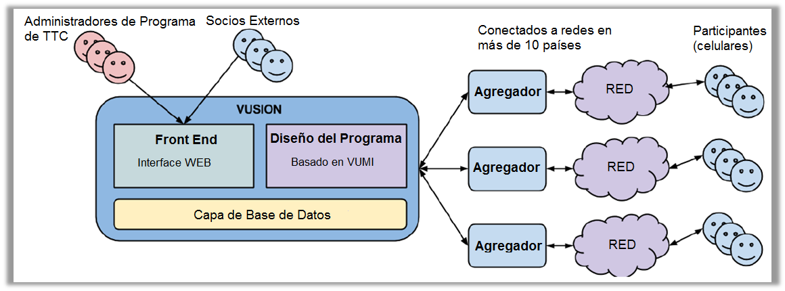

Diseño del Programa Vusion
+++++++++++++++++++++++++++

Está guía explicará el diseño del sistema (plataforma) Vusion. Para poder enviar un mensaje de Vusion al celular de un participante se usa mucha arquitectura (diseño y desarrollo de sistema). Desde el software Vusion en un servidor, la nube a través de la red móvil de nuestros socios a los celulares de los participantes, todas las partes involucradas necesitan entregar el mensaje exitosamente.

Vista General
--------------

El diagrama de abajo muestra una vista sistemática del sistema y arquitectura Vusion. La arquitectura de Vusion consiste de dos partes. En la izquierda puede ver el servidor Vusion con el software Vusion funcionando. Aquí es donde la información acerca del programa es almacenada.
En la parte derecha puede ver a los agregadores y las redes. Esta sección maneja el transporte de mensajes desde los servidores Vusión a los participantes y de regreso. Los participantes son las personas con celulares, quienes son contactados por los programas asociados a Text to Change.

	Vista sistemática de la arquitectura de Vusion.

Servidor Vusion
----------------

Primero nos enfocaremos en la parte izquierda de la imagen: el servidor Vusion. El servidor Vusion es un sistema de software que funciona en un servidor virtual en la nube. El sistema de software puede realizar un número de tareas.

Primeramente ofrece un sitio web a través del cual el administrador del programa puede crear programas. El administrador del programa crea y configura el programa.  Una vez que se crea el programa, el adminsitrador puede realizar seguimiento del progreso y recolectar resultados, todo a través de la interface de la web. Puede encontrar una introducción a está interface web aquí: :doc:`Vusion introduction<login>`

El software Vusion está diseñado para posibilitar el envío de SMS a números telefónicos del sistema. Esta es una característica central de los programas que ejecutamos. Al enviar mensajes, se pueden alcanzar personas. Vusion ahce eso posible. Los mensajes pueden ser enviados porque Vusion está conectado a las redes de las compañías telefónicas. La siguiente sección contiene mayor información acerca del rol de las telefónicas.

Finalmente, además de enviar mensajes el software también puede recibir mensajes. Esto significa que los mensajes recibidos también pueden ser almacenados. Lo que lo hace a Vusion especial es que no solamente se puede enviar y recibir mensajes, sino también procesar el contenido de los mensajes y tener respuestas específicas de acuerdo al contenido. Cuando se recibe un mensaje que contiene cierta palabra, Vusion puede realizar cierta acción. Esto le da al administrador del programa la posibilidad de crear interacciones complejas entre el participante y Vusion. De esta forma programas interactivos son creados.

El servidor Vusion con el software Vusion en el, es el cerebro del sistema. Es el lugar desde el cual todo es controlado y desde donde se toman las decisiones.

Integrador (Red de Transporte) y Operadores Telefónicos 
--------------------------------------------------------

En la anterior sección se habló acerca del sistema de software Vusion. En está sección se cubrirá como Vusion envía un mensaje y este llega a la persona correcta (deseada).

Para que los mensajes vayan de Vusion a los participantes de ida y vuelta, se usa un integrador. Vusion es una plataforma de SMS por lo tanto toda la comunicación va a través de redes de operadores móviles. En cada país funcionan cierto número de operadores de red móvil. Algunos muy conocidos son:

* Movilgate
* Orange
* Airtel
* Vodacom
* Vodafone

Hay muchas más de estas compañías. El rol del integrador y las telefónicas reside en que ellos tienen bases de red GSM a través de todo el país. Ellos conectan los celulares a la red de modo que los usuarios puedan recibir mensajes de texto y llamadas telefónicas. Normalmente estos operadores envían y reciben mensajes a y desde las redes a otras compañías telefónicas. Al hacer tratos con estas compañías, Vusion también está conectada a estas redes. Esto significa que Vusion es capaz de enviar y recibir mensajes de texto a través de las redes conectadas.

Puede que esto suene sencillo, pero existe un número de asuntos que lo hacen ligeramente complejo.

En casi todos los países hay varios operadores móviles, cada uno con su red de estaciones base. Mobile phones are connected to these networks. One of the problems we face is that not all phones connect to all networks. For example if someone has an Orange phone, it only connects to the Orange mobile network. This means that If we want to communicate with that person, we need to make a deal with Orange. If we want to be able to connect to all users, we need to make deals with all the mobile network operators active in a country. This can be a very time-consuming process, but luckily there is a solution: Aggregators.

Un integrador es una companía local que tiene conexión con algunas o todas las redes de telefonía de un país. Hacer un trato con un integrador nos da acceso a multiples redes de telefonía al mismo tiempo. De esta forma podemos alcanzar más gente con nuestros programas.

.. nota::
	**Códigos Cortos**

	Normalmente los números de telefonía celular tienen alredeor de 10 dígitos. Estos son demasiados números para que la gente los recuerde rápidamente. En muchas campañas las personas pueden enviar un mensaje de texto con una palabra a un número para recibir información o para suscribirse a un programa, si tienen que recordar un número muy largo esto no funciona. Para resolver este problema, las telefónicas ofrecen un servicio llamado **código corto**. Un código o número corto es especial, puede ser asignado a un servicio. Usualmente tiene de 4 o 5 dígitos, lo cual significa que es fácil para la gente recordarlo.
	Cuando alguien envía un mensaje de texto al código corto, el mensaje es remitido al destino al cual el código corto está registrado. En nuestro caso, Vusion. 

