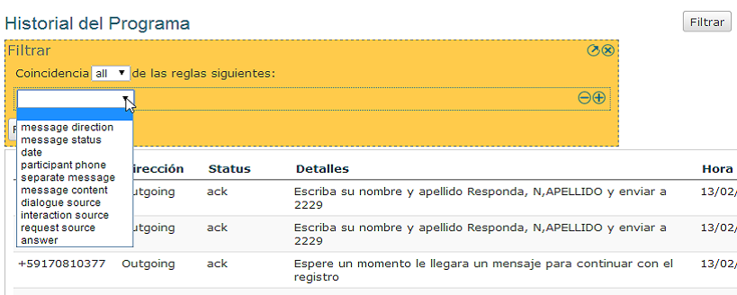
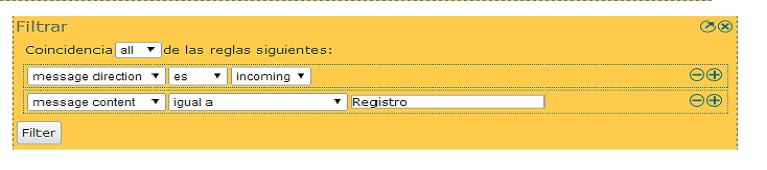
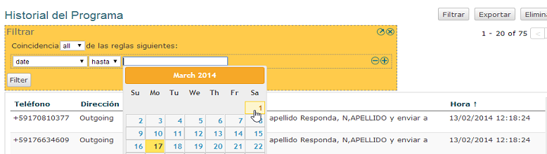
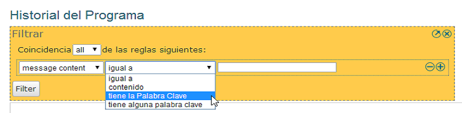
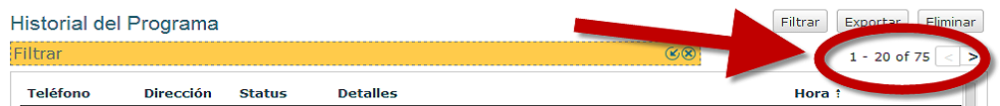

Filtrado de Historial
======================

El historial del programa provee algunas poderosas herramientas de filtrado. Empiece yendo a la página de "Historial" de un programa y haga click en el botón "Filtrar" que se encuentra en la parte superior derecha de la pantalla. Esto le dará un recuadro amarillo en el cual puede comenzar a definir su filtro o filtros.

La siguiente imagen muestra el recuadro del filtro y la pestaña que ofrece los varios filtros que pueden ser usados:

Desde aquí se puede definir el filtro. Pero primero veamos más detalladamente la pestaña del filtro para observar que opciones existen para filtrar.

Coincidir "all" (todas) o "any" (algunas) reglas del filtro
############################################################

Lo primero que se puede notar es que en la parte superior se puede elegir entre:

* *coincidir* **all** *de las siguientes reglas*
* *coincidir* **any** *de las siguientes reglas*

Si se elige coincidir con **all (todas)** las reglas, los mensajes que apareceran luego del filtrado coincidiran con **all (todas)** las condiciones que se definieron en el filtro. Por lo tanto, si se eligió el filtro "Incoming Messages (mensajes entrantes)" y mensajes que contienen(messages containing) la palabra *hola*, los mensajes mostrados serán solamente los mensajes que sean ambos entrantes (incoming) **y** que contengan la palabra *hola*. Mensajes que **no** sean entrantes y que contengan **no** la palabra "hola" NO serán mostrados.

Si se elige coincidir con **any (algunas)** of the rules it works different. Suppose we want to filter on messages containing the word *hello* or messages containing the word *bye*. We would then say we want to match any of the rules, and define described filters. The end result will be a list of all messages containing the word *hello* and all the messages containing the word *bye*.

Si todavía no está claro, pienselo de esta forma. Si usamos la regla *all* basicamente estaremos diciendo que cada fila de filtro tiene un **Y** entremedio. Porque la lista resultante de mensajes tendrá que coincidir con el primer filtro **Y** el segundo filtro, **Y** el tercer filtro, etc. Cuando se usa *any* el **Y** es reemplazado por **O**. 

Para definir una regla de filtrado (UN FILTRO)
###############################################

Una vez que se haya decidido si se quiere coincidir *all (todos)* o *any (algunos)* de los filtros, podemos empezar a definir las reglas de filtrado.

Primero se selecciona el tipo de filtro. Los siguientes tipos de filtro están disponibles:

* *message direction* - filtre mensajes entrantes (incoming) o salientes (outgoing)
* *message status* - filtre de acuerdo al estado (status) del mensaje
* *date* - filtre en base a las fechas de los mensajes enviados/recibidos
* *participant phone* - filtre por número de teléfono (o parte de él)
* *message content* - filtre on any of the words or strings in the message content
* *dialogue source* - filtre los mensajes que se relacionan a un diálogo en específico
* *interaction source* - filtre los mensajes pertenecientes a una interacción en específico
* *answers* - filtre en coincidencia o no a respuestas a preguntas realizadas

Una vez que se haya elegido el tipo de filtro que se quiera usar, aparecerán diferentes opciones para aplicarlo. Para algunos filtros un segundo recuadro aparecerá. 

Este segundo recuadro permite elegir varias opciones para la aplicación del filtro. Por ejemplo, si se elige el filtro *message direction (dirección del mensaje)*, un segundo recuadro aparecerá haciendo posible la elección entre mensajes incoming (entrantes) o outgoing (salientes).

Para algunos otros filtros un tercer recuadro estará disponible en el cual se pueden proveer detalles adicionales. El filtro de date (fecha) es un buen ejemplo. Cuando se elige date (fecha) se obtendrá un segundo recuadro en el cual se podrá elegir entre *until (hasta)* y *since (desde)*, sin embargo, un tercer recuadro también se presentará, en este se puede escribir la fecha exacta en la cual se quiere el filtro.

Otro ejemplo es el filtro de contenido de mensaje (message content):

Se puede elegir entre tres opciones en el segundo recuadro y el recuadro de texto nos da la posibilidad de escribir una palabra o fila sobre la cual VUSION buscará la coincidencia.

Se pueden añadir más reglas haciendo click en el botón **+** ubicado a la derecha de la regla de filtrado. Esto nos proporcionará otra línea en la cual definir un filtro adicional. A la inversa, las reglas de filtrado pueden ser eliminadas al hacer click en el botón **-** que se encuentra al lado del botón **+**.

Para obtener los resultados del filtrado
#########################################

Una vez que todas las reglas de filtrado hayan sido definidas haga click en el botón *Filter* que se encuentra debajo de las reglas, esto dará inicio al proceso de filtrado. Luego de un momento de espera los mensajes coincidentes aparecerán.

Pueded ver todos los mensajes usando las flechas al costado derecho del filtro. Aqui también podrá ver cuantos mensajes coindicen con su filtro:

Si el filtro no proveyó los resultados esperados puede hacer click en el botón con una flecha pequeña, ubicado en la parte derecha del recuadro amarillo de filtro para empezar a editar el filtro y tratar nuevamente con parámetros de filtrado diferentes.

Es importante notar que una vez definido un filtro se puede guardar fácilmente, guardando el URL (link o dirección de enlace) como favorito (con el marcador de favorito). Luego, yendo al mismo URL (link) puede obtener el mismo filtro nuevamente. Esta es una forma fácil de volver a ingresar a filtros pasados creados o usados en el pasado.

También puede exportar los datos filtrados usando la opción **Export History (Exportar Historial)**. Esta opción se encuentra en la parte superior derecha de la pantalla. Al exportar se puede realizar mayor análisis de los datos usando un programa o aplicación externa, Excel por ejemplo.

