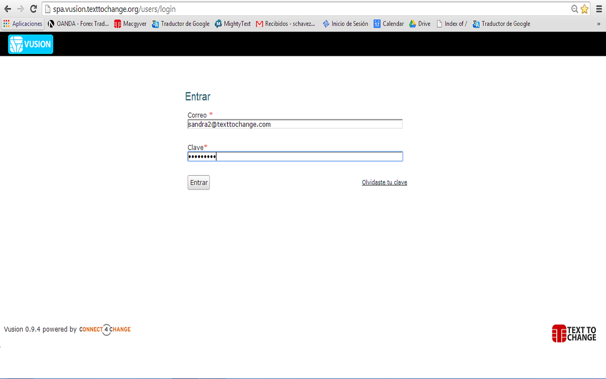

Introducción a la Interface Vusion 
-----------------------------------
En esta sección cubriremos la interface de Vusion. El objetivo de esta guía es que el usuario pueda iniciar su sesión, seleccionar su programa y familiarizarse con la interface del programa.

Inicio de Sesión
================

Esta es la pantalla del Inicio de Sesión de Vusion. La dirección es `http://spa.vusion.texttochange.org <http://spa.vusion.texttochange.org>`_. En esta pantalla puede iniciar sesión usando las crecenciales entregadas por el Encargado Nacional de TTC de su país. Es una combinacion única de e-mail y contraseña. 

Índice del Programa
====================
Una vez iniciada su sesión exitosamente accederá automáticamente a esta pantalla. Es la página índice del programa.

.. figure:: _static/img/image19mockup.png
   :width: 850px
   :align: center
   :alt: image19.png
   :figwidth: 850px

#. Primero, vea la barra negra en la parte superior de la pantalla, en la parte derecha de ella podrá ver el nombre de su cuenta. Para ver o cambiar la configuración de su cuenta puede hacer click en Mi Cuenta. Para cerrar su sesión de Vusion haga click en Salir y será redireccionado a la pantalla de inicio de sesión. 

#. Debajo de la barra negra puede ver los programas disponibles para usted. Los programas se muestran en un cuadro azul. En la parte izquiera de este cuadro puede ver el nombre del programa, el país del programa y el código corto con el cual funciona. En la parte derecha del cuadro encontrará algunas estadísticas del programa. El número de participantes, el número de mensajes enviados y el número de mensajes programados (por enviar).

#. En la parte derecha de la pantalla verá una lista de asuntos recientes de su programa. Generalmente los mensajes entrantes que el sistema no puede procesar correctamente terminan en esta lista. Cuando el programa no está funcionando correctamente revisar está lista puede ser de mucha utilidad.

Menu de Operaciones del Programa
=================================

Cuando hace click en un proyecto, usted es redireccionado a la página principal del proyecto. Desde esta página puede administrar en programa y realizar las tareas que desee.

#. Debajo de la barra negra de la parte superior de la pantalla verá una barra azul. Esta es la barra del programa. En la parte izquiera de la barra podrá ver el nombre del proyecto y el país, entre paréntesis, en el cual el programa se lleva a cabo junto con el código corto del programa. En la parte derecha se encuentran la fecha y la hora de la locación del programa.
#. Debajo de la barra azul, en la parte izquiera encontrará una columna que es la Barra de Navegación del Menú. A través de este Menú se puede acceder a diferentes funciones, características y herramientas que Vusion tiene para ofrecer. Como puede ver algunas de las opciones del Menú de Navegación están oscurecidas, esto significa que estas opciones actualmente no están disponibles para su cuenta.
#. Debajo de la Barra de Navegación del Menu podrá ver un recuadro pequeño, llamado Live Log (registro en vivo). Este muestra lo que el sistema está haciendo en tiempo real. 
#. A la derecha del Menu de Navegación, la cola de envío se encuentra visible. Esta muestra todos los mensajes que están en la lista por ser enviados. Como puede ver, en este momento está vacía. En la parte superior derecha de la lista está el botón de Reempezar Trabajo, el cual le permite manualmente ver todos los mensajes programados y tambien reiniciarlos.
#. Antes de empezar a enviar mensajes se necesita tener participantes en el programa. Para ver, importar y administrar participantes haga click en Participantes en el Menú de Navegación. Más acerca de administración de participantes puede ser encontrado en el :doc:`Participant Management guide <participant_management>`

There are guides available to explain most of the features in the Navigation Menu. These guides will explain the features and show you how you can use them. 
 - Solicitudes: :doc:`Requests guide <requests>`
 - Diálogos: Aún no hay guía disponible 
 - Mensajes Separados: :doc:`Seperate messages guide <seperatemessage>`
 - Mensajes Predefinidos: see :doc:`Seperate messages guide <seperatemessage>`
 - Contenido de Variables: :doc:`Content Variable guide </advanced/contentvariable>`
 - Participantes: :doc:`Participant Management guide <participant_management>`
 - Historial: :doc:`History Filtering guide <filtering-history>`