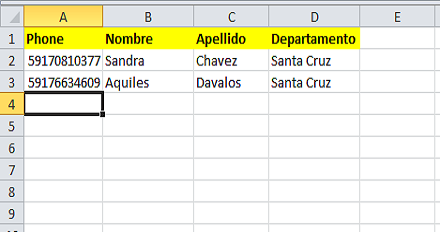

Administración de los Participantes
+++++++++++++++++++++++++++++++++++
Esta sección cubre la administración de los participantes en Vusion. Administrar los participantes de forma eficiente es muy importante, especialmente en programas con gran cantidad de participantes. Vusion tiene numerosas herramientas a disposición para ayudarlo en las tareas varias que posiblemente necesite realizar.

Los participantes son una parte muy importante del sistema Vusion. Un participante es identificado por su número de celular. En la base de datos de Vusion más información puede ser añadida al registro del participante, tal como la fecha en la cual el participante fue añadido a la base de datos, dialogos en los cuales se encuentra registrado (enrolled) y las tags y labels que contienen información adicional acerca del participante. Toda esta información junta puede crear un perfil extenso del participante. Esta información luego puede ser exportada y analizada.

	La pantalla de Participantes de Vusion 

Añadir participantes
---------------------

Una de las primeras y más básicas tareas cuando se inicia el uso de Vusion es añadir participantes a la base de datos de Vusion. Para poder enviar un mensaje necesita tener por lo menos un participante en su base de datos.

Añadir un participante
================================
Para añadir un participante haga click en el botón **Añadir**. Ubicado en la parte superior derecha de la pantalla.  

.. figure:: _static/img/part_add.PNG
	:width: 800px
	:align: center
	:alt: image19.png
	:figwidth: 800px

	La pantalla de Adición de Participantes de Vusion 

Ahora verá una pantalla en la cual puede ingresar un número de teléfono. Ingrese el número telefónico del participante que quiera añadir y haga click en el botón Guardar. Felicidades! Añadio un participante. Ahora este participante aparecerá en la pantalla de Participantes.

Importar participantes de un archivo
=====================================
En muchos casos añadir participantes uno por uno no es muy eficiente. Existe otra forma de añadir participantes y es importarlos de un archivo. Haciendo click en el botón **Importar** se podrá acceder a la pantalla de Importación de Participantes. Aca podrá escoger un archivo del cual quiera que Vusion importe los contactos.

	La pantalla de Importación de Participantes de Vusion 

Puede importar de un archivo CSV o XLS. La primera columna deberá contener los números de celulares. Las otras columnas en la primera fila serán vistas como labels de los participantes, en la cual el nombre de la label será el nombre asignado a cada columna de esta primera fila.

	La primera entrada de la primera columna , celda A1 en Excel, deberá siempre contener el texto "phone". Otras columnas pueden contener Labels para los participantes

En la pantalla de Importación de Participantes también puede añadir automáticamente un tag a los participantes importados. Escriba el tag que quiera añadirles a los participantes en el espacio "Tag imported participants". Cuando seleccione el archivo correcto y el tag que quiera añadir, haga click en **Subir**. El archivo será subido y los participantes serán añadidos a la base de datos con el tag adjuntado.

Administración de los Participantes 
------------------------------------

La administración de sus participantes puede hacerse de dos maneras diferentes. Si necesita hacer un cambio a un solo participante, o solamente a algunos, puede hacerlo individualmente. También puede realizar acciones a grupos de participantes al primero seleccioanr el grupo que se quiere modificar y luego realizar la acción para todo el grupo.

Administración de Participantes Individuales
=============================================
Hay casos en los cuales necesita realizar una acción a un solo participante. Puede Ver, Editar o Eliminar participantes de forma individual con los botones mostrados a la derecha de cada participante. 

- El botón **Mostrar** lo llevará a una pantalla que mostrará los detalles acerca del participante. Mostará información básica del participante como su número de teléfono, labels y tags. También muestra el historial del participante, aquí podrá ver el historial de toda la comunicación entre Vusion y el participante. También tenemos opciones para Editar o Eliminar el participante
- El botón **Editar** lo llevará a una pantalla en la cual podrá cambiar la información de los participantes. Cosas que puede cambiar aquí: Número de teléfono, Labels, Tags y los diálogos en los cuales el participante esta subscrito (enrolled). 
- El botón **Eliminar**, eliminará al participante de la base de datos, incluyendo el historial del participante. Esta acción es permanente y no puede ser deshecha, por favor tenga precaución.

Filtrado de Participantes
==========================
Cuando es necesario aplicar las acciones a grupos más grandes de participantes, los controles de la parte superior hacen sencillo manejar grupos grandes. Acciones que se pueden realizar con los grupos de participantes son: Exportar, Tag, Untag y Eliminar. Antes que pueda realizar una acción a un grupo de participantes, la primera tarea a realizar es seleccionar el grupo que quiera modificar. Es muy importante seleccionar el grupo correcto, de otra forma el proceso puede ir mal fácilmente. Para seleccionar el grupo debe usar el botón de filtrado.

Cuando hace click en el botón de filtro, un recuadro amarillo grande aparecerá. 

	Esta es la interface de Filtro. 

En la interface de Filtrado puede crear filtros para seleccionar registros con cierta información. Por ejemplo: como dijimos antes, todos los participantes importados de un archivo son automáticamente asignados con el tag: **imported**. Al usar el filtro podemos seleccioanr participantes con este tag. Para crear un filtro que seleccione a todos los participantes con el tag **imported**, primero haga click en Filtrar. Ahora puede ver el recuadro amarillo de filtrado. La primera línea con las opciones "all" y "any" no son relevantes por ahora. Se volvera a eso luego. Por ahora, haga click en la pestaña vacia y seleccione "tagged". Ahora 2 recuadros extras aparecerán. Estos tres recuadros forman una regla de filtrado. Para seleccionar todos los participantes con el tag "imported", seleccione un filtro con::
	
	tagged | con | imported

Now click Filter. The page will reload and show all records of participants with the tag "imported". Using this same method you can filter on a number of other characteristics. At the moment you can filter on:
 - **phone**: filtre por número de teléfono.
 - **optin**: filtre por fecha de opt-in (ingreso o activación a la plataforma).
 - **optout**: filtre por opt-out (salida o desactivación de la plataforma).
 - **enrolled**: filtre por los diálogos en los cuales el participante está registrado (enrolled in).
 - **tagged**: filtre en base a los tags que tiene el participante.
 - **labels**: filtre en base a las labels que tiene el participante.

Luego de seleccionar la opción en base a la cual quiera filtrar, recuadros especiales aparecerán a lado del primer recuadro para hacer el filtro más específico. 
El ejemplo de arriba muestra como seleccionar un filtro. La mayoría de las veces una regla de filtrado será suficiente para seleccionar lo que necesita, pero algunas otras veces necesitará filtros más complejos. En Vusion es posible crear más de una regla de filtrado al solamente hacer click en el botón "+" que se encuentra en la parte superior derecha del recuadro de filtrado. Esto generará otra línea en la cual podrá ingresar otra regla de filtrado. Cuando se ingresa más de una regla de filtrado es cuando la diferencia entre "all (todo)" y "any (alguno)" en la primera línea del recuadro de filtrado cobra mucha importancia. 

Suponga que tiene dos reglas de filtrado, regla A y regla B y el filtro esta seleccionado para "Coincidir all (todo)". Ahora solo se mostrarán los participantes (registros) que coincidan con la regla A **y** la regla B. Cuando el filtro este seleccionado para para "Coincidir any (alguno)", todos los participantes (registros)  coincidan con la regla A **O** la regla B serán seleccionados. En otras palabras, cuando se selecciona "all (todo)", **ambas** reglas tienen que cumplirse, y cuando se selecciona "any (alguno)", **por lo menos una** regla tiene que cumplirse. 

En Vusion es posible crear filtros con múltiples reglas de filtrado. Cuando se trabaja con múltiples reglas de filtrado, es muy importante entender la diferencia entre elegir la coincidencia de "all (todas)" o "any (algunas)" de las reglas de filtrado.

Para estudiar más detenidamente las opciones de filtrado de Vusion, por favor diríjase al :doc:`History Filtering guide <filtering-history>`

Realizar acciones en grupos de participantes 
=============================================
Cuando se haya hecho la selección correcta, puede aplicar acciones a todos los participantes seleccioandos. Las acciones disponibles son:

 - **Tag**: Añadir un Tag a todos los participantes seleccionados. Un tag es un texto corto que puede ser usado para marcar a ciertos participantes.
 - **Untag**: Remueve un Tag de todos los participantes seleccionados.
 - **Exportar**: Desacarga a su computadora un archivo CSV, que contiene los participantes seleccionados por el filtro aplicado. El archivo contiene todos los detalles de los participantes, como tags y labels. Los archivos exportados pueden ser analizados en Excel o en otros programas de análisis.
 - **Eliminar**: Elimina a los participantes seleccionados de la base de datos. Cuando se eliminan participantes, son removidos de forma permanente. Esta acción no puede ser deshecha.

Es muy importante recordar que estas operaciones se realizarán en todos los participantes que hayan sido seleccionados. Esto significa que tiene que ser muy cuidadoso, especialmente cuando se eliminen grupos de participantes.

