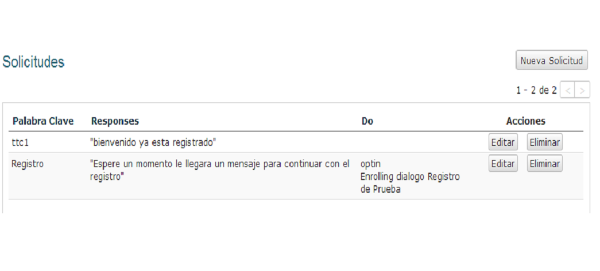
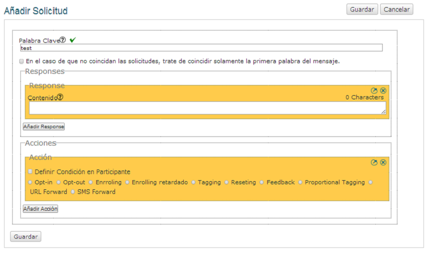

Solicitudes
++++++++++++

En Vusion existen diferentes formas de interaccionar con los participantes. Una de esas formas es a tráves de las Solicitudes. Usar una Solicitud es una forma de que se aplique una acción automática cuando un mensaje ingresa con cierta Palabra Clave. Cuando se configura una Solicitud se escoge una Palabra Clave que la active, y también se elige una acción que quiera que Vusion realize si se ingresa esa Palabra Clave.

Para administrar las Solicitudes del programa, haga click en Solicitudes en el menú del programa. Esto lo llevará a la pantalla de Solicitudes. Acá puede ver una lista con las Solicitudes activas y sus respectivas Palabras Claves, Respuestas y Acciones.

	Pantalla de Solicitudes 

Como puede ver hay un número de Solicitudes actualmente activas. Cada Solicitud tiene su propia Palabra Clave, con respuestas y acciones diferentes. 

Para crear una nueva Solicitud, haga click en el botón de Nueva Solicitud. Acá puede añadir una Solicitud a su programa. Hay 3 cosas que necesitan configurarse antes de crear una Solicitud.

 1. La Respuesta debe tener una Palabra Clave única para que los mensajes puedan ser reconocidos.
 2. La Respuesta puede tener una o más respuestas. Una Response (Respuesta) es una respuesta automática para cuando entre un mensaje que contenga una Palabra Clave.
 3. La Respuesta puede tener una o más Acciones. Vusion puede realizar un número de Acciones, desde simples como añadir un tag al participante a más complicadas como activar eventos o mensajes programados. Las Acciones se explican a mayor detalle en la parte de abajo.

Esta es la pantalla en la cual se añaden nuevas Solicitudes.

	La pantalla para añadir Solicitudes, aquí puede crear una nueva solicitud 

Las características a configurar son:

Palabras Clave
===============

Lo primero al crear una Solicitud es crear una Palabra Clave. La Palabra Clave se usa como identificador. Todos los mensajes que comiencen con una palabra clave serán procesados como una Solicitud por Vusion. Para que los mensajes puedan ser identificados y procesados correctamente es necesario que las Palabras Claves sean únicas para cada solicitud. Una buena característica de Vusion es que de forma automática revisa si la Palabra Clave que quiere usar esta disponible o ya está siendo usada en otra Solicitud.

.. nota:: 
	En Vusion las Palabras Claves no diferencian entre mayúsculas y minúsculas por lo que la palabra *REGISTRAR* coincidirá con *registrar* y también con *REgisTRAR*. 
	Es importante notar que las Palabras Clave tienen que ser únicas, es decir no repetirse, no solamente en el programa sino en todo el código corto en el cual funciona el programa. En la mayoría de los países solo tenemos a disposición uno o dos códigos cortos, mientras manejamos muchos más programas. Esto significa que diferentes programas tienen que funcionar en el mismo código corto. Vusion se asegurará que no se use una Palabra Clave que ya este siendo usada, pero de todas formas es importante tener este punto en mente cuando se esta configurando la Palabra Clave.

Para configurar la Palabra Clave simplemente debe ingresar la palabra en el campo de *Palabra Clave*.

El recuadro para seleccionar (tickear) debajo del campo de Palabra Clave afecta como ciertos mensajes de texto coinciden con la Palabra Clave. Es importante entender exactamente que hace ya que los efectos son bastante sutiles. Tienen que ver con que si Vusion coincidirá la Palabra Clave con el mensaje completo o solamente con la primera palabra. Por ejemplo:

El administrador de un programa esta configurando la Palabra Clave "REGISTRO" para un programa. 

Caso 1: El recuadro para seleccionar no esta seleccionado 
Vusion hará coincidir los mensajes que contengan **solo** la Palabra Clave. Por ejemplo Vusion hará coincidir el mensaje:
	
	*Registro*

Sin embargo Vusion **no** hará coincidir:

	*Registro por favor, quiero mi registro!*

Caso 2: El recuadro para seleccionar esta seleccionado 
Ahora Vusion tratará de hacer coincidir todo el mensaje a una Palabra Clave. Sin embargo cuando esto falla, tratará de hacer coincidir la primera palabra del mensaje con la Palabra Clave. Por ejemplo Vusion todavía hará coincidir el mensaje:

	*Registro*

Y **también** coincidirá el mensaje: 

	*Registro por favor, quiero mi registro!*

La diferencia entre estos dos casos es importante de entender. Se basa en la diferencia de buscar la coincidencia dentro del mensaje completo versus buscar la coincidencia con la primera palabra. Cuando se esté configurando la Solicitud deberá decidir cuidadosamente cual elegir para alcanzar los resultados esperados. 

Cuando la Palabra Clave ha coincidido exitosamente Vusion puede llevar a cabo dos acciones. Enviar una respuesta al participante o realizar una acción.

Response (Respuesta)
==========

La Response (Respuesta) se usa para contestar automáticamente al participante. Para añadir un mensaje Response (Respuesta) a una Solicitud, haga click en el botón de *Añadir Response*. Aparecerá un recuadro amarillo en el cual podrá definir el mensaje que será enviado. 

Puede añadir más de una Response (Respuesta) a una Solicitud al simplemente hacer click en el botón *Añadir Response*. Cada click añadirá una Response (Respuesta). También puede borrar una Response (Respuesta) al hacer click en el botón *X* que se encuentra en la esquina derecha del recuadro amarillo de Response (Respuesta).

Acciones
===========

Luego de automáticamente enviar una Response (Respuesta) como recién se explicó, se puede hacer mucho más con una Solicitud. También es posible hacer Solicitudes que activen Acciones. Acá es donde la plataforma Vusion realmente muestra su versatilidad y posibilidades. También es donde configurar Vusion se complica un poco, ya que las Acciones pueden programar y activar otros eventos. 
Actualmente en Vusion hay implementadas varias Acciones que se pueden usar.

 - **opt-in**: Esto registrará al remitente del SMS como Participante del programa. El remitente será añadido a la base de datos de participantes. Un participante tiene que tener el estado opt-in para que se le puedan enviar mensajes a través de la plataforma Vusion.
 - **opt-out**: Esta Acción cancela la acción opt-in descrita anteriormente. Pondrá al Participante en un estado opt-out (estado pasivo). Los Participantes que esten en estado opt-out no recibirán mensajes del programa y apareceran pintados de rojo en la Pantalla de Participantes. Todos los tags y labels serán removidos.
 - **enroll**:  Esta Acción pone al participante en un diálogo. Para mayor información acerca de los Diálogos, vaya a la Guía de Diálogos. En la parte referencte a Diálogos -> enrolling
 - **delayed enroll**: Realiza la Acción de enroll con retraso (programado). Se puede seleccionar el tiempo de un retraso, día y hora en la cual el enrrollment (la acción) se llevará a cabo.
 - **tag**: Añada un tag a un Participante.
 - **reset**: Aplique un opt-out seguido de un opt-in. Removerá todos los tags y labels de la base de datos del Participante y ahora aparecerá como un Participante "limpio".
 - **feedback**: Envía una respuesta automática al Participante. Esta acción es muy similar a la Response (Respuesta).
 - **proportional tag**: Esto le da la posibilidad de automáticamente dar un tag a una parte de los participantes y otro tag al resto de los participantes. Esta característica es usada para dividir aleatoriamente a los Participantes en grupos, por ejemplo si quiere elegir aleatoriamente al 5% de sus participantes para darles un premio, puede usar esta Acción para darles el tag al 5% de sus participantes como el grupo ganador.
 - **url forward**: Reenvía el mensaje entrante a un URL. Cuando se esta haciendo un proyecto de recolección de datos, posiblemente el socio quiera analizar los resultados por su cuenta en tiempo real. Usando esta Acción los mensajes todavía estarán en Vusion pero también serán reenviados directamente a otro servidor designado.
 - **sms forward**: Esta Acción enviará un SMS a todos los Participantes que tengan un cierto tag. El contenido del mensaje puede ser generado dinámicamente. Puede encontrar más información en el :doc:`SMS forwarding guide </advanced/smsforwarding>`

 Como puede ver hay muchas Acciones disponibles. Además de ello puede añadir más de una Acción a una Solicitud, dependiendo de sus necesidades. Añadir Acciones múltiples funciona de la misma forma que añadir Solicitudes multiples. Hacer click en el botón de añadir agregará otra Acción a su Solicitud.
 Cuando se está diseñando una Solicitud un buen primer paso es definir exactamete que debería pasar si se activa la Solicitud. Si eso se define claramente, elegir la combinación apropiada de Acciones se convierte en algo mucho más sencillo.
