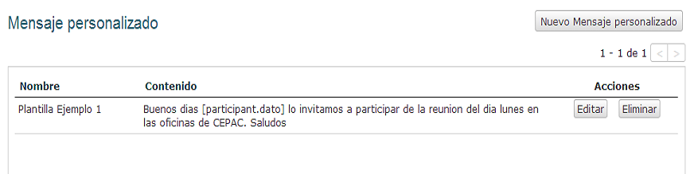

Mensajes separados y Mensajes personalizados
+++++++++++++++++++++++++++++++++++++++++++++

Enviar un mensaje a un grupo de personas en Vusion es fácil. Esta guía le explicará como puede enviar un mensaje a un grupo de personas. Se usa este tipo de mensajes cuando no se requiere interacción con los participantes.

Mensajes Separados 
==================

En el menú del programa encontrará un item llamado Mensajes Separados. Esto lo llevará a la pantalla de Mensajes Separados. 

En esta pantalla podrá ver una lista de Mensajes Separados enviados previamente con algunos detalles acerca de ellos. La lista también muestra los mensajes programados. Estos son mensajes que ya fueron creados y están listos para ser enviados, esperando que llegue el tiempo para el cual el envío fue programado. Si el mensaje programado todavía no fue enviado todavía se le pueden hacer cambios. Para hacerle cambios, haga click en el botón Editar en la parte derecha del mensaje. 

También existe la posibilidad de eliminar un Mensaje Separado. Si el mensaje todavía no fue enviado será removido de los mensajes programados. Si el mensaje ya fue enviado, el eliminarlo borrará el registro del mensaje de Vusion.

.. advertencia:: El recuadro necesita ser tickeado (checking)
.. nota::
	La mayoría de las características de los mensajes se explican por si solas. Por ejemplo La Hora muestra a que hora fue creado el mensaje. Algo que no es tan sencillo de interpretar es la columna de Delivery (Envío). En esta columna verá seis números, de los cuales el significado no es claro inmediatamente. Estos números representan el estado de los mensajes enviados. Estos son detalles técnicos que se encuentran muy relacionados a la forma en la cual los mensajes son enviados en Vusion. Imagine que tiene un mensaje con el Delivery Status (Estado de envío): 6 (5/4/3 -2/1)

	- 6: Número total de mensajes enviados

	- 5: Número de mensajes aceptados por las compañías telefónicas 
	- 4: Número de mensajes que todavía están esperando ser aceptados por las compañías telefónicas 
	- 3: Número de mensajes rechazados por las compañías telefónicas 

	- 2: Check
	- 1: Check

Enviar un mensaje separado es fácil: en la pantalla de Mensajes Separados, haga click en Nuevo Mensaje Separado. Esto lo llevará a la pantalla Añadir Mensaje Separado. 

En esta pantalla puede crear un Mensaje Separado. Para crear un Mensaje Separado necesita ingresar 4 características.

 - **Nombre**

   Acá debe ingresar el Nombre que quiere darle a este Mensaje Separado. Use este nombre para reconocer el mensaje. Si es la invitación para un evento le podría dar un nombre como:  *Invitación para la Reunión de Enero*.

 - **Enviar A**

   Define a quien se enviará el mensaje. Acá hay 3 opciones

	 - **Todos los participantes:** Envíe el mensaje a todos los participantes del programa.
	 - **Participante coincidente:** Esta opción trabaja de forma similar a la opción Filtrado de Participantes. Acá puede seleccionar una o más características para los participantes, en base a los tags (etiquetas) disponibles. Los participantes que coincidan con las características (tags) escogidas recibirán el mensaje.
	 - **Lista de participantes:** Use los número de teléfonos de un archivo. Haga click en el botón *Seleccionar Archivo* y seleccione el archivo de su ordenador.

 - **Content (Contenido)**

   El contenido del mensaje es el mensaje que los participantes seleccionados recibirán. Puede usar un mensaje predefinido al seleccionarlo de la pestaña disponible que se encuentra encima del recuadro para definir el contenido. Esto hará que el mensaje predefinido aparezca en el recuadro de Content (Contenido). Más adelante se explicará como crear un Mensaje Personalizado (predefinido).

   También puede simplemente escribir el mensaje que desee enviar en el recuadro de Content (Contenido). 

 - **Programación**

   La Programación establece el momento en el cual quiere que Vusion envíe el mensaje. Puede hacer que Vusion haga el envío inmediatamente, o programar el mensaje para que sea enviado en algún punto en el futuro. Para programar un mensaje seleccione *Hora Fija*, y haga click en el círculo para seleccionar la opción. Un seleccionador aparecerá para ayudarlo a establecer correctamente la  fecha y hora.

   .. nota:: 
      El selector de fecha y hora trabaja estableciendo una fecha y hora absolutos, no fecha y hora relativos. La fecha y hora que ingrese serán la fecha y hora en el que el mensaje será enviado.

Una vez que estás características hayan sido establecidas, haga click en *Guardar* para guardar el mensaje creado. Si programa el mensaje para que sea enviado inmediatamente el mensaje será enviado inmediatamente. Si programa el mensaje para ser enviado algún tiempo en el futuro, el mensaje se guardará y enviará en el tiempo definido. En este caso todavía podrá realizar ajustes a su mensaje antes de su envío programado.

Mensajes Personalizado 
======================

En el menú del programa, debajo de Mensajer Separados encontrará un item llamado *Mensajes Personalizados*. En esta pantalla podrá definir y guardar un mensaje que luego podrá usar como Mensaje Separado por ejemplo. Esto puede ser útil si tiene que enviar el mismo mensaje múltiples veces.

Cuando haga click en Mensajes Personalizados en el Menú del Programa, verá la pantalla de Mensajes Personalizados.

Acá puede ver una lista de mensajes actualmente disponibles. Haciendo click en el botón Editar puede cambiar (editar) un Mensaje Personalizado. Haciendo click en el botón Eliminar podrá borrar el mensaje.

Para crear un Mensaje Personalizados haga click en el botón Nuevo Mensaje Personalizado. Esto le dará una pantalla en la cual podrá escribir el mensaje. 

Esta pantalla es muy simple. Tiene dos recuadros de texto. En el primero debe ingresar el nombre del Mensaje Personalizado. Use un nombre que haga fácil el reconocer el mensaje. Luego verá un recuadro en el cual se debe redactar el contenido del mensaje. Este es el texto que eventualmente será enviado a los participantes. 

Haciendo click en el botón *Guardar*, guardará su Mensaje Personalizado para que lo pueda usar cuando lo requiera.
