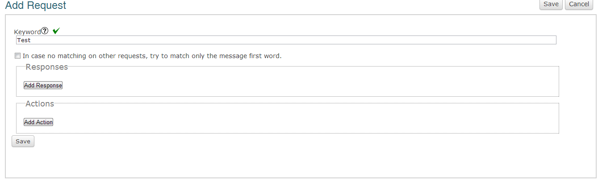
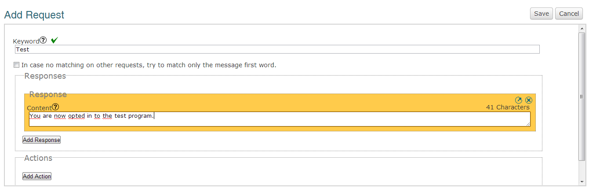
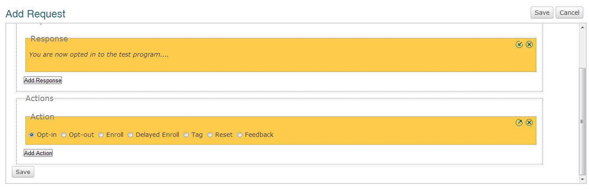

Solicitudes
#########################

General
=================

Una solicitud permite que los participantes interactuen con Vusion. La parte más importante de una solicitud es la palabra clave.
Esto le permitirá al sistema clasificar el mensaje de texto del participante y así darle una respuesta apropiada o activar una acción requerida.
El signo verde significa que la palabra clave aún no está en uso, si aparece una cruz roja significa que la palabra clave está siendo usada por otro programa. Tendrá que escoger otra palabra clave.
Puede escribir varias palabras claves y separarlas con una coma, en ese caso todas las palabras claves escritas activaran la misma respuesta. Esto puede utilizarse para prever posibles variaciones o errores de escritura que el usuario final pueda tener al enviar la palabra clave.

La casilla para marcar que dice *'En el caso de que no coincidan las solicitudes, trate de coincidir solamente la primera palabra del mensaje.'*.
Esta opción sirve para aumentar la posibilidad de que aún cuando el participante no responda con la palabra clave pero con algún mensaje similar, el participante todavía recibirá una respuesta en lugar de ser un error.
En la práctica esto significa que cuando un usuario envíe INFO en lugar de INFO 1 coincidirá con la palabra clave INFO 1. La coincidencia completa tendrá siempre prioridad ante la coincidencia parcial, por lo cual INFO 1 coincidirá con INFO 1 y no con INFO.

Ejemplo 1:

- Solicitud: INFO
- Casilla para marcar: no
- Usuario envía: INFO 1
- **Vusion no procesará la coincidencia** 

Ejemplo 2:

- Solicitud: INFO
- Casilla para marcar: si
- Usuario envía: Info si quiero info
- **Vusion procesará la coincidencia** 

Una response (respuesta) es lo que la persona que envío el mensaje con la palabra clave al número corto recibirá de forma inmediata luego de enviar el mensaje. 
Las respuestas no deben exceder los 160 carácteres, límite de un mensaje de texto. 

Cuadno haya diseñado una response (respuesta) puede añadir una acción a la solicitud. Esto es algo que pasará
cuando alguien envíe un mensaje de texto con la palabra clave al número corto.

Es importante notar que **todos** los participantes necesitarán tener el estado opt-in (activado) para poder participar en el programa.
Notar también que la acción enroll automáticamente le da al participante el estado opt-in. 

Una vez que hizo todo esto, guarde su solicitud.

Para una explicación en la diferentes acciones disponibles por favor vaya a la página: acciones.