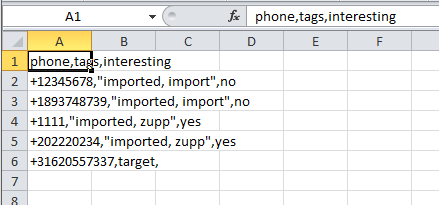
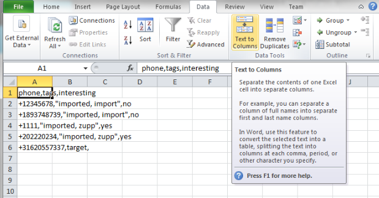
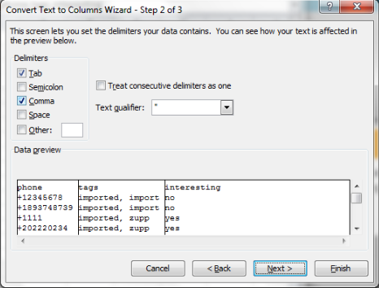
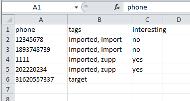

Utilisation de :index:`fichiers CSV` dans Excel
--------------------------------------

Ce guide couvre l'utilisation de fichiers CSV dans Excel. Vusion exporte de fichiers avec les données des participants et d'autres types de données dans un format appelé CSV. CSV signifie Comma Séparé valeur. Un fichier CSV existe des lignes de valeurs qui sont séparées par des virgules. La première ligne du fichier se compose généralement d'en-têtes de colonnes.

Ces fichiers peuvent être ouverts dans Excel. Cependant, quand vous faites cela, Excel ne sera pas formater automatiquement les données de la bonne façon. Au lieu de cela, il ressemblera à ceci:

Pour être en mesure de les analyser, vous devez effectuer une étape supplémentaire. Comme vous pouvez le voir, le texte dans les cellules doit être divisé par les séparateurs par des virgules. Il ya une fonction dans Excel qui peut le faire pour vous. Cette fonction est appelée texte en colonnes:

Cela fera apparaître un assistant. Il est important de choisir la bonne façon de scinder le texte. Vous devez diviser le texte délimité par une virgule

Si vous avez correctement divisé le texte en mettant comme séparateur des virgules, il va maintenant ressembler à ceci:

Félicitations, vous avez ouvert avec succès l'exportation CSV dans Excel!
