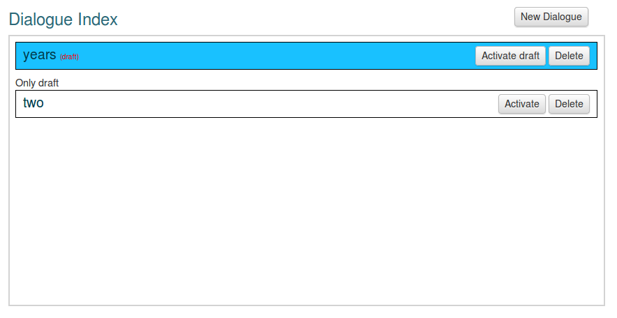

:index:`Dialogues`
++++++++++++++++++++

Ce guide couvrira l'option de dialogue dans Vusion. Les dialogues sont utilisés dans Vusion de mettre en place des interactions plus complexes avec le participant. Cette section est destinée aux utilisateurs expérimentés Vusion et n'explique pas les concepts de base Vusion.

Introduction aux dialogues
============================
- Qu'est-ce qu'un dialogue
- Quand est ce que vous utilisez les dialogues

Lors de l'apprentissage sur les dialogues et la façon de les utiliser, il est très important de comprendre la structure d'un dialogue. Un dialogue doit être considéré comme un certain nombre d'interactions. Une interaction est soit un message à l'adhérent, ou une question que vous posez au participant. Avec une question, il ne peut y avoir différents types de questions, et les réponses aux questions peuvent à leur tour déclencher des actions ou d'autres réponses. Cela peut devenir très compliqué si vous perdez la trace de la structure de base du dialogue.

Vous pouvez utiliser les Dialogues pour créer des programmes où vous souhaitez poser une série de questions au participant. Un excellent exemple de l'objet de dialogues sont des enquêtes de SMS. Enquêtes existent généralement d'une série de questions, où la question suivante est posée lorsque la question a été répondu. Il peut aussi y avoir une certaine logique impliquée dans la structure de l'enquête. Un exemple de ce que pourrait être que, quand une personne répond à une question sur son âge, il pourrait l'exclure de nouvelles questions, parce que l'enquête ne vise que les personnes dans une tranche d'âge spécifique.

Index de dialogue
=======================

En cliquant sur l'option Dialogues dans le menu du programme ouvre l'index de dialogue. Cet écran vous donnera une vue d'ensemble des dialogues actuellement disponibles. Il peut ressembler à ceci:

Ici, nous pouvons voir toutes les caractéristiques importantes de l'index de dialogue ensemble. Ces fonctionnalités permettent de gérer les dialogues.

De tous dans le coin supérieur droit est d'abord sur le bouton Nouveau de dialogue. En cliquant sur ce bouton, vous pouvez créer un nouveau dialogue. Création d'un dialogue est assez complexe. Il est expliqué en détail dans la section suivante.

Système de brouillon
---------------
Sous le bouton Nouveau de dialogue, il ya deux dialogues différents. L'un est appelé «années» et le second est appelé «deux». Comme vous pouvez le voir, ils ont des couleurs différentes. Ces couleurs ont des significations différentes. Lorsqu'un dialogue est affiché en blanc, il s'agit d'un nouveau dialogue qui n'a pas encore été activé. Il dispose d'un bouton "Activer" et un bouton "Supprimer". Le dialogue ne sera pas opérationnel jusqu'à ce qu'il soit activé.

Quand un dialogue est actif, il sera montré que le bleu de l'indice de dialogue. Comme on peut le voir sur l'image, le "années" dialogue est présentée ici en bleu il est donc un dialogue actif. Vous pouvez consulter le contenu du dialogue en cliquant sur son nom.

Notez que à côté du nom il ya un petit texte rouge dicton (projet). Quand quelqu'un édite un dialogue actif la nouvelle version sera enregistrée comme un "projet" Version. Il ne sera pas activé immédiatement, mais il va générer le texte rouge disant "projet", et un bouton disant "Activer Projet". Maintenant, vous avez deux versions du dialogue. Il s'agit de la version originale qui est toujours actif, et il ya un projet de version qui n'est pas actif. Vous pouvez modifier le projet de la version en cliquant sur le rouge (projet) texte. Lorsque vous avez terminé l'édition, et que vous voulez remplacer l'ancienne version avec la version préliminaire, cliquez simplement sur "Activer Projet". Maintenant, l'ancienne version sera supprimée et la nouvelle version sera activée.

Ce système vous permet de créer et de modifier un dialogue sans que cela devienne actif tout de suite afin que vous puissiez vérifier et de supprimer toutes les erreurs avant qu'il ne soit activé pour tous les participants.

Création d'un dialogue
========================
	
  Lors de la création d'un dialogue, d'abord définir clairement les questions et messages. Quand envoyer, ce qui se passe avec certaines réponses etc. Cela vous aidera à obtenir la structure de la bonne enquête.

Nom, priorité toggle et enrôlement automatique
-------------------------------------------------

  Les premières choses que vous avez à faire lors de la création d'un nouveau dialogue est de choisir un nom.
  
  Après cela, il est une case à cocher pour décider si vous souhaitez utiliser la fonctionnalité des priorités. En cochant cette case, donner des messages sortants de cette priorité de dialogue dans Vusion. Cela peut aider à s'assurer que les messages soient livrés à temps, même si Vusion est très occupé.
  
  Grâce à la fonctionnalité d'inscription automatique, vous pouvez vous inscrire automatiquement tous les participants actuellement au programme dans ce nouveau dialogue. Ceci est particulièrement utile lorsque les participants ont été importés à partir d'un fichier, et une nouvelle enquête est créée.
  
  Lorsque ces options sont mises en place, vous pouvez commencer à ajouter des interactions à votre dialogue.

Interactions
-------------

  Les interactions sont les blocs de construction que le dialogue se compose de. Une interaction doit être considérée comme une question (ou dans certains cas juste un message) qui est envoyé à un participant. Le participant sera alors répondre à la question. Il est également possible d'ajouter des mesures à différents options de réponse. Ces options créent ensemble un puissant

  Pour ajouter une interaction à un dialogue, cliquez simplement sur le bouton Ajouter une interaction. Une boîte jaune apparaîtra représentant la nouvelle interaction. Dans cette boîte, il ya pas mal quelques options disponibles pour configurer correctement la question.

Définition d'une interaction
------------------------

	Lorsque la mise en place d'une interaction, la première chose que vous devez faire est de définir le moment où l'interaction aura lieu. Pour cela, il ya quatre options que vous pouvez sélectionner.

	#. **Heure fixe:** Lancer cette interaction à une date fixe et sur ​​un temps fixe. Exemple: 1er mai à 09h00.
	#. **Heure décalée** exécute l’interaction d'un certain nombre de minutes après que le participant a été inscrit dans le dialogue. Exemple: 30 minutes après l'inscription
	#. **Jours décalés** exécute l'interaction d'un certain nombre de jours après que le participant a été inscrit dans le dialogue, et à un moment précis de la journée. Exemple: 7 jours après l'inscription, 11:00
	#. **Réponse requise**: Lancer l'interaction après l'autre question a été répondue. Cela vous donnera une liste déroulante où vous pouvez sélectionner une interaction précédente. Lorsque cette question a été répondue, cette interaction va commencer. Remarque: Ce ne sera pas disponible pour la première interaction dans un dialogue

	Maintenant, le moment de l'interaction a été défini, nous devons définir le contenu de l'interaction. Il existe trois types de contenu d'interaction disponibles, étant une annonce, question et question multi-mot. Ils ont tous leurs propres options et paramètres. Ils seront expliqués dans les sections ci-dessous.

Annonce
^^^^^^^^^^^^

	L'interaction d'annonce est l'interaction la plus simple. Il n'est rien de plus un message qui sera envoyé au participant. Une fois sélectionné, vous êtes présenté avec une zone de texte pour écrire votre message. Pas d'options ou fonctionnalités supplémentaires sont disponibles.

Question
^^^^^^^^^^^

  Pour configurer une question, sélectionnez la case à cocher question. Maintenant, beaucoup plus d'options apparaissent. La section suivante tente d'expliquer toutes les options disponibles.

  Première dans la zone de contenu, vous pouvez écrire la question que vous voulez poser le participant, ainsi que des instructions sur la façon dont le participant doit formater sa réponse.

  Suivant les mots-clés dans le champ, vous pouvez définir le mot-clé associé à cette question. La réponse d'un participant donne doit être formaté comme suit: [mots-clés] + [Réponse]. Assurez-vous que vous ne dites participants exactement comment la réponse doit être formaté.

  Vient ensuite une case disant: «Utilisez modèle de paramètres du programme". Il s'agit d'une fonction patrimoniale, qui doit être décochée.

  Maintenant, vous avez le choix si vous voulez créer une ouverture ou une question fermée. En général, pour des questions avec un nombre limité de réponses possibles une question fermée devrait être définie. Si il ya une grande quantité de réponses possibles, définir une question ouverte. Est important de noter que lors de la définition d'une question ouverte, il n'est pas possible d'ajouter une action. Avec une question fermée cela est possible, si c'est ce que vous devez garder à l'esprit tout en choisissant le type de votre question.

  Sélection du type de question sera de nouveau ouvrir certaines options.

  Première pour les questions ouvertes: questions ouvertes vont vous demander de définir un label de réponse. La réponse donnée à la question sera stockée dans le profil des participants en utilisant ce tag. Exemple: régler la mise tag "Age", lorsqu'un participant répond à la question, il gagnera un label appelé âge de sa réponse à la valeur. Aussi des questions ouvertes vous donnent la possibilité d'ajouter des commentaires lorsque la question a été répondue.

  Les questions fermées ont également la possibilité de réponse du tag.

  Ensuite, il ya l'option "Accepter aucun espace entre mot-clé et le choix". Si cette option est cochée, Vusion s'attend par exemple "age24" comme une réponse à une question avec le mot clé «âge». Quand ce n'est pas cochée, la réponse "24 ans" est prévu. Une différence subtile.

  Après cela, les réponses possibles doivent être définies. Si vous avez un «oui» ou «non» question, définir deux réponses. Un pour «oui» et un pour «non». Maintenant, vous pouvez ajouter des commentaires et des actions pour les deux réponses possibles.

  Maintenant, la question et les réponses possibles sont mises en place. L'interaction est pratiquement définie. Maintenant, il ya un couple d'options qui peuvent être réglés. Tout d'abord le nombre maximum de réponses non-concordance. Lorsqu'elle est cochée, vous pouvez définir un nombre maximum de réponses non-concordance, et également ajouter une action lorsque il ya des réponses plus dépareillés. Vous pouvez par exemple choisir de ne pas le participant après un certain nombre échoué la tentative de répondre.

  Ensuite, vous pouvez envoyer automatiquement les informations lorsque la réponse n'est pas à rattacher. Vous pouvez par exemple l'utiliser pour expliquer le bon format de la réponse quand une réponse incomparable sera reçue.

  Enfin, comme la dernière option, vous pouvez définir des rappels pour quand pas de réponses auront été reçues après un certain laps de temps. Lorsque cette option est sélectionnée, une boîte de dialogue apparaît lorsque le nombre de rappels peut être défini. Il ya aussi une option pour sélectionner le temps de décalage des rappels. Ce temps peut être réglé en quelques minutes ou en quelques jours. 
  Enfin, vous pouvez joindre l'action à la mémoire, à effectuer des tâches supplémentaires.

Question multi-mots-clés
^^^^^^^^^^^^^^^^^^^^^^^^^^^

	Mise en place d'une question multi-mot est un peu plus facile que d'une question normale. Pour comprendre pourquoi, il est important de savoir quelle est la différence entre une question normale et une question à plusieurs mots clés est. Comme expliqué ci-dessus, en réponse à une question, la réponse est toujours formaté comme [mots-clés] + [Réponse]. Le mot-clé est utilisé pour reconnaître ce qui est question répondu et la réponse peut être enregistré et interprété. Des questions multi-mots-clés fonctionnent un peu différemment. Dans les questions multi-mot-clé toutes les réponses possibles sont mises en place comme des mots clés différents. Cela signifie que lorsque vous définissez un mot-clé multi-style de question, le participant ne dispose que de répondre avec [Réponse], et Vusion va le reconnaître comme l'une des possibilités offertes.

	.. admonition:: Example
		:Class: example
		

		Lorsque la mise en place d'une question demandant le sexe du participant, le format de réponse dans le style de question normale serait [mot clé] + [réponse], ainsi par exemple:

		SEXE MASCULIN

		Lorsque la question est réglée comme une question à plusieurs mots clés, le format de réponse sera tout simplement [réponse], donc:

		MASCULIN

	Ce que vous devez noter est que seules questions à choix multiples peuvent être configurés comme des questions multi-mot-clé, c'est parce que vous avez à définir les réponses possibles lors de la mise en place de la question. Une autre chose importante à retenir est que lors de la création une question à plusieurs mots clés, toutes les possibilités de réponse seront mises en place en tant que mots-clés, tout comme les mots-clés utilisés pour déclencher des demandes. Comme chaque mot clé ne peut être utilisé qu'une seule fois sur un numéro court, vous devez être très prudent lors de la mise en place des questions multi-clés. Cela est particulièrement vrai quand il ya plusieurs programmes s'exécutant sur le même numéro court.

	Mise en place d'une question à plusieurs mots clés est très sensiblement la même que la mise en place d'une question fermée normale. D'abord, vous entrez dans le contenu de la question que vous voulez poser le participant et sélectionnez un tag sous lequel la réponse sera stockée.

	Après cela, vous devez définir les réponses possibles. Parce que chaque réponse sera également définie comme un mot-clé, Vusion vérifiera automatiquement si le mot clé est toujours disponible. Quand une coche verte apparaît, le mot clé est accepté. Maintenant, il est possible d'ajouter des commentaires et des actions pour la réponse, tout comme avec une question fermée normale.

	Lorsque toutes les réponses sont mises en place, il ya encore la possibilité d'ajouter des rappels à la question en cochant la case Rappel Set. Les champs apparaîtront pour vous permettre de sélectionner le nombre de rappels, le décalage rappel et éventuellement ajouter des actions au rappel.

  Il décrit l'ensemble du processus de création d'un dialogue. Comme vous l'avez vu, il ya beaucoup d'options et beaucoup de possibilités pour créer le dialogue d'une manière qui convient le programme. Avant, quand la création d'un dialogue, il est important de garder toujours la structure globale à l'esprit. De cette façon à ce que vous ne serez pas perdu dans les options et perdre l’aperçu. 

