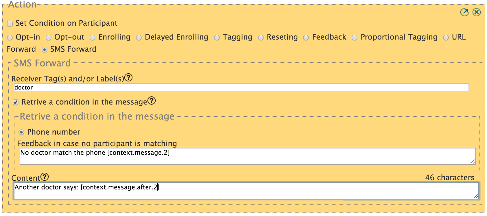

:index:`Transmission de SMS`
##############################

Cas d'utilisation
------------------
Considérons la suite de cas d'utilisation: Une organisation met en place un service d'alerte et de sauvetage. Participant peut demander de l'aide de l'organe de cette organisation en envoyant simplement AIDE à un numéro court. Le SMS sera automatiquement transmis à un membre différent de l'organisation qui fera en sorte que quelqu'un dans le quartier se rendra de toute urgence ce participant.

Le dessin ci-dessous montre comment ce cas d'utilisation pourrait fonctionner.

.. image:: _static/img/smsforwarding_use_case.jpg

**1 :** Le participant envoie un message d'alerte.

**2 :** Vusion crée un message de notification à tous les participants qui sont taggés d'alerte. Le message peut être personnalisé pour inclure les informations des participants, le temps ou même le contenu du message d'alerte.

**3 :** Les participants taggés reçoivent le message de notification.

Comment configurer un SMS transféré
-------------------------------------

Soit dans une requête ou un dialogue, vous pouvez sélectionner l'action du SMS transféré de la liste des actions. Deux champs apparaissent comme indiqué ci-dessous:
 

* *Récepteur Tag (s) ou label (s)* est une zone de texte, vous entrez dans les tags ou les labels que le participant doit correspondre afin de recevoir le message de notification. S'il vous plaît assurez vous que certains partipants sont actuellement opt-in et sont taggés avec ce tag sinon personne sera avisé.
* *Récupérer une condition dans le message*, est une case à cocher pour indiquer que certaines conditions concernant les personnes à suivre ce SMS sont dans le SMS initial lui-même. Lorsque cette case est cochée, deux autres champs doivent être définis:
	* Le type de condition pour l'instant, seulement si le *téléphone* est disponible
	* Rétroaction au cas où aucun participant est correspondant qui est un message de retour de l'envoi au cas où aucun participant est correspondant à son état.
* *Le contenu* est ce champ de texte,vous entrez dans le message de notification qui sera envoyé. Pour plus de détails sur la façon de personnaliser ce message, consultez la section suivante.

:index:`Message de notification`
------------------------------

Ceci est un exemple de message de notification. 

Dans cet exemple, nous supposons que l'envoi de l'alerte a été créée sur le programme avec 2 labels:

#. nom: Tom
#. adresse: 3rd av behind city mall Mombasa

Ainsi avec ce contenu de message de notification:
::
	"Alert [participant.name] ([participant.phone]) at [participant.address] say '[context.message]' at [time.H]:[time.M]"

Sera personnalisé comme:
::
	"Alert Tom (+2567702222) at 3rd av behind city mall mombasa says 'Alert help' at 10:50"
	

Un autre exemple de plusieurs éléments de temps:
::
	"Alert from [participant.name] at [time.H]:[time.M] on [time.d]/[time.m]"

Sera personnalisé comme:
::
	"Alert from +2567702222 at 10:50 on the 09/04"

Pour plus de détails sur :doc:`un message de personnalisation  </advanced/message_customisation>`
