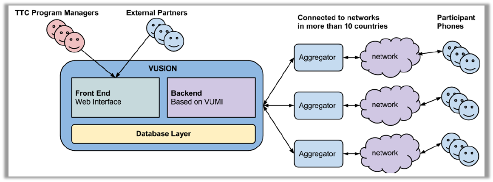

:index:`L'architecture du back-end (arrière plan) de Vusion`
+++++++++++++++++++++++++++++++++++++++

Ce guide vous expliquera l'architecture du système Vusion. Pour envoyer un message de Vusion sur le téléphone mobile d'un participant, beaucoup d'infrastructures est utilisé. À partir du logiciel de Vusion fonctionnant sur un serveur cloud à travers les réseaux mobiles de nos partenaires vers le téléphone mobile du participant, toutes les parties sont nécessaires pour délivrer le message avec succès.

Overview
-----------

Le diagramme ci-dessous montre un aperçu schématique du système et de l'infrastructure de Vusion.
L'infrastructure de Vusion est composée de deux parties. Sur la gauche vous pouvez voir le serveur Vusion avec le logiciel Vusion entrain d’exécuter là-dessus. C'est là que les informations sur le programme sont stockées. Sur la droite de cela, vous pouvez voir les agrégateurs et les réseaux. Cette section gère le transport des messages des serveurs Vusion aux participants et vice-versa.
Les participants sont les gens avec les téléphones cellulaires qui sont atteints par les programmes exécutés par TTC.

:index:`Server de Vusion`
--------------------------

Nous allons d'abord mettre l'accent sur le côté gauche de l'image: le serveur de Vusion. Le serveur de Vusion est un système logiciel qui s'exécute sur un serveur virtuel dans le cloud. Le système de logiciel effectue un certain nombre de tâches. 

Premièrement, il propose un site à travers lequel le gestionnaire de programme peut mettre en place des programmes. Le gestionnaire de programme crée et configure le programme. Une fois que le programme est mis en place, il peut garder la trace de l'avancement et de récolter les résultats, tout au long de cette interface web. Une introduction à cette interface web peut être trouvée ici: Vusion l'introduction.

Deuxièmement, le logiciel Vusion est conçu pour permettre d'envoyer des messages SMS à des numéros de téléphone dans le système. Il s'agit d'un élément central dans les programmes que nous exécutons. Par l'envoi de messages, les gens peuvent être atteints. Vusion rend cela possible. Les messages peuvent être envoyés parce Vusion est connecté aux réseaux mobiles des compagnies de téléphone. La section suivante contient plus d'informations sur le rôle des compagnies de téléphone.

Enfin, en plus de l'envoi de messages le logiciel est également capable de récepteur de messages. Cela signifie que le contenu des messages reçus peut être stocké. Ce qui le rend spécial, c'est que Vusion peut non seulement stocker les messages reçus, mais aussi interpréter le contenu des messages et réagir à ce contenu. Lorsqu'un message sera reçu contenant un certain mot, Vusion peut effectuer une certaine action. Cela donne le gestionnaire de programme la possibilité de créer des interactions complexes entre Vusion et le participant. De cette façon, des programmes interactifs sont créés.

Le serveur Vusion avec le logiciel Vusion dessus est le cerveau du système. C'est l'endroit où tout est contrôlé, et où les décisions sont prises.

.. note::
   :index:`Sécurité` 

  Comme les programmes peuvent contenir des données importantes ou sensibles, la sécurité du système de Vusion est très importante. Nous avons pris les mesures nécessaires pour s'assurer que le système de Vusion est correctement garanti. Le système est hébergé en cloud situé dans un centre de données sécurisé. De cette façon, l'hébergement assure même si une des machines tombe en panne, le système continue à fonctionner sur une machine différente. Si cette configuration redondante devait échouer, vos données ne seront toujours pas perdues. Le système crée un back-up quotidien qui est crypté et stocké hors site. Ces sauvegardes sont conservées pendant trois mois. Cela permettra d'assurer que les données de vos recherches ne seront pas perdues.

Il ya aussi des mesures en place pour empêcher les personnes non autorisées d'accéder aux données du système. Le logiciel de Vusion est conçu avec un nombre de niveaux d'utilisateur. Selon votre niveau d'utilisateur que vous avez accès au bon groupe de programmes. Tous les autres programmes en cours d'exécution sur le système sont cachés en toute sécurité, et les données de ces programmes ne sont pas accessibles. De cette façon, nous pouvons nous assurer que personne d'autre que les personnes concernées ont accès aux données. Plus d'informations sur les niveaux d'utilisateurs peuvent être trouvées dans le guide des  :doc:`niveaux d'utilisateur </advanced/understanding-user-levels>`. Enfin TTC ne partagera jamais les données du projet sans la permission du propriétaire du projet.

:index:`Réseau de transport`
-------------------------------

Dans la section précédente, nous avons parlé du logiciel du système de Vusion. Dans cette section, nous verrons comment Vusion envoie un message texte qui se termine sur le téléphone de la bonne personne.

Pour obtenir les messages texte de Vusion aux participants et en retour, un réseau de transport est utilisé. Vusion est une plate-forme de SMS ainsi toute communication passe par les réseaux des opérateurs de réseaux mobiles. Dans chaque pays, un certain nombre de ces opérateurs de réseaux mobiles sont actifs. Parmi les plus connus à travers l'Afrique sont les suivants:

========    ==========
Orange      Airtel
Vodacom     Vodafone
MTN         Tigo
========    ==========

Il ya beaucoup plus de ces entreprises. Le rôle des opérateurs de réseaux mobiles, c'est qu'ils ont un réseau de stations de base GSM partout dans le pays. Ils se connectent les téléphones portables sur le réseau afin que les utilisateurs peuvent envoyer et recevoir des messages SMS et des appels téléphoniques. Normalement, ces opérateurs mobiles envoient et recevez des messages avec les réseaux d'autres compagnies de téléphone. En faisant traite de ces compagnies de téléphone, Vusion est également relié à ces réseaux. Cela signifie que Vusion est capable d'envoyer et recevoir des messages texte à travers les réseaux connectés.

Cela peut sembler facile, mais il ya un certain nombre de questions qui font qu'il est un peu complexe.

Dans presque tous les pays, il existe de nombreux opérateurs de réseaux mobiles, chacun avec leur propre réseau de stations de base. Les téléphones mobiles sont connectés à ces réseaux. L'un des problèmes auxquels nous sommes confrontés, c'est que tous les téléphones se connectent à tous les réseaux. Par exemple, si quelqu'un a un téléphone Orange, il se connecte uniquement au réseau mobile Orange. Cela signifie que si nous voulons communiquer avec cette personne, nous avons besoin de faire un accord avec Orange. Si nous voulons être en mesure de se connecter à tous les utilisateurs, nous avons besoin de faire des affaires avec tous les opérateurs de réseaux mobiles actifs dans un pays. Cela peut être un processus de longue haleine très, mais heureusement il ya une solution: agrégateurs.

Un agrégateur est une entreprise locale qui a un lien avec une partie ou l'ensemble des opérateurs de réseaux mobiles dans le pays. Faire un accord avec un agrégateur nous donne accès à de multiples réseaux mobiles à la fois. De cette façon, nous sommes en mesure d'atteindre plus de gens avec nos programmes.

.. note::
	:index:`Numéros courts`

  Normalement, les numéros de téléphone mobile sont autour de 10 chiffres. C'est trop long pour que les gens se souviennent rapidement. Dans un grand nombre de campagnes gens peuvent texte un mot à un numéro de téléphone pour recevoir des renseignements ou d'adhérer à un programme. S'ils ont à se rappeler un très long numéro cela ne fonctionne pas. Pour résoudre ce problème, les opérateurs de réseaux mobiles offrent un service appelé shortcode. Un numéro court est un numéro spécial, à court téléphone qui peut être affecté à un service. Il est généralement 4 ou 5 chiffres, ce qui signifie qu'il est facile pour les gens à se rappeler. Quand quelqu'un envoie un texte à un numéro court, le message est transmis à la destination que le shortcode est enregistré. Dans notre cas, Vusion.

