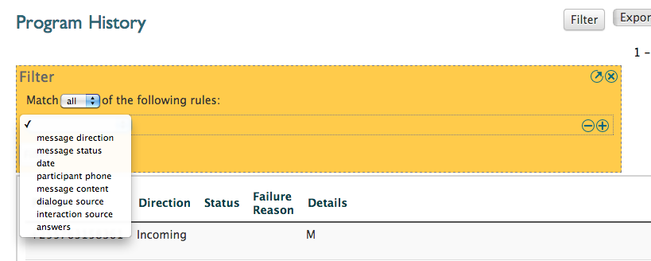
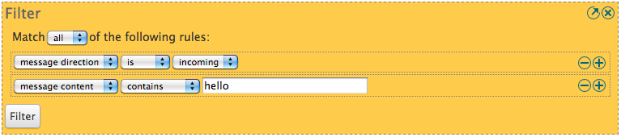
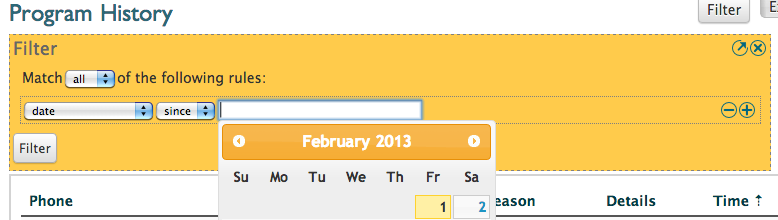
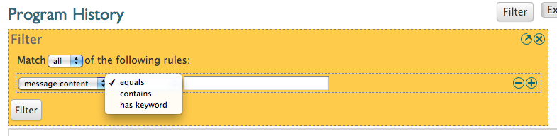
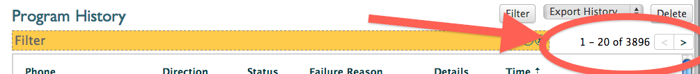

:index:`Historique du filtrage`
=================================

L'historique du programme fournit des outils de filtrage puissants. Commencez par aller à la page de l'historique d'un programme et en cliquant sur le bouton de filtre en haut à droite de l'écran. Cela vous donnera un bloc jaune dans lequel vous pouvez commencer à définir votre filtre.

L'image suivante montre la boîte de filtre et le menu déroulant avec tous les différents filtres qui peuvent être utilisés:

A partir de cela, nous pouvons commencer à définir les filtres. Mais laissez-nous d'abord de plus près à l'écran de filtre et de voir quelles sont les options que nous avons pour le filtrage.

Correspondance d’une partie ou de toutes les règles de filtre
#################################################################

La première chose que nous remarquons est sur ​​le haut, nous pouvons choisir entre: 

* *correspond à **tous** les règles suivantes*
* *correspond à l'**une** des règles suivantes*

Si nous adaptons à toutes les règles, les messages qui apparaîtront après filtrage remplissent toutes les conditions que vous avez définis précisément dans le filtre. Donc, si vous dites que vous voulez filtrer les messages et les messages entrants contenant le mot bonjour, les messages affichés seront uniquement les messages qui sont à la fois entrant et avoir le mot bonjour en eux. Les messages non entrants ne contenant pas le mot bonjour seront affichés.

Si nous associer une parties des règles il fonctionne différemment. Supposons que nous voulons filtrer les messages contenant le mot bonjour ou des messages contenant le mot bye. Nous pourrions alors dire que nous voulons pour correspondre à l'une des règles, et définir des filtres décrits. Le résultat final sera une liste de tous les messages contenant le mot bonjour et tous les messages contenant le mot bye.

Si cela est encore confus, pensez-y de cette façon. Si nous utilisons la toute règle, nous allons essentiellement dire que chaque ligne du filtre a "ET" écrite entre les deux. Parce que la liste résultante des messages devra correspondre au premier filtre et le second filtre, et le troisième filtre, etc. Lorsque nous utilisons toute "ET" est remplacé par "OU".

Définition d'une règle de filtrage
######################################

Une fois que nous avons décidé si nous voulons reconnaître tout ou des filtres que nous pouvons commencer à définir nos règles de filtrage.

Nous avons d'abord sélectionné le type de filtre. Les types suivants sont actuellement disponibles:

* *direction de message* - filtre soit sur les messages entrants ou sortants
* *état du message* - filtre sur l'état du message
* *date* - filtre sur dates des messages qui ont été envoyés / reçus
* *participant téléphone* - Filtre sur le numéro de téléphone (ou une partie de celui-ci)
* *contenu du message* - filtre sur l'un des mots ou des chaînes dans le contenu du message
* *source de dialogue* - filtre sur les messages qui se rapportent à un dialogue spécifique
* *source d'interaction* - filtre sur les messages relatifs à une interaction spécifique
* *réponses* - filtre sur le couplage ou non-concordance des réponses aux questions

Une fois que nous avons choisi le type de filtre que nous voulons utiliser, il ya quelques options différentes.

Pour certains filtres une seconde liste déroulante apparaît qui nous permet de choisir différentes options pour le filtre. Par exemple, si nous choisissons la direction du message de filtre, une seconde liste déroulante apparaît que nous permet de choisir entre les messages entrants ou sortants.

Pour les autres filtres, il y aura une troisième boîte était nous pouvons fournir plus de détails. Le filtre de date est un bon exemple. Quand nous choisissons date nous recevons une deuxième liste déroulante pour choisir entre jusqu'à et depuis, cependant, une troisième boîte est également présenté étions nous pouvons mettre la date réelle à partir de laquelle nous voulons filtrer.

Un autre exemple est le filtre de contenu de message:

Nous pouvons choisir entre trois options dans le deuxième menu déroulant et la zone de texte qui nous donne la possibilité d'écrire un mot ou une chaîne sur laquelle VUSION fera correspondre.

Nous pouvons ajouter d'autres règles en appuyant sur le bouton **+** à droite d'une règle de filtrage. Cela nous donnera une autre ligne sur laquelle définir un filtre supplémentaire. En revanche, les règles de filtrage peuvent être retirées en appuyant sur le bouton **-** à côté d'une règle de filtrage.

Obtenir des résultats de filtrage
###################################

Une fois que toutes les règles ont été définies, vous pouvez appuyer sur le bouton de filtre sous les règles commencent à filtrer. Après un peu d'attente les messages correspondants apparaîtront.

Vous pouvez passer en revue tous les messages en faisant défiler et en utilisant les touches fléchées vers le côté du filtre. C'est aussi été vous pouvez voir le nombre de messages correspondant à votre filtre:

Si le filtre n'a pas donné les résultats escomptés, vous pouvez cliquer sur le petit bouton de la flèche sur le côté droit de la boîte de filtre jaune pour commencer à modifier le filtre et essayez à nouveau avec des paramètres différents.

Il est important de noter qu'une fois que vous avez défini un filtre, vous pouvez facilement enregistrer en stockant l'URL à vos signets. Puis, en allant vers la même URL que vous aurez à nouveau le même filtre. C'est un moyen facile de revisiter filtres dernières.

En outre, vous pouvez exporter les données filtrées à l'aide de la liste déroulante Exporter l'historique en haut à droite de l'écran. En exportant vous pouvez faire une analyse plus approfondie des données dans une application externe, comme Microsoft Excel. Pour utiliser le fichier CSV exporté dans Excel, suivez ce guide  :doc:`Mini guide: Utilisation de fichiers CSV dans Excel </advanced/csv_split>`

