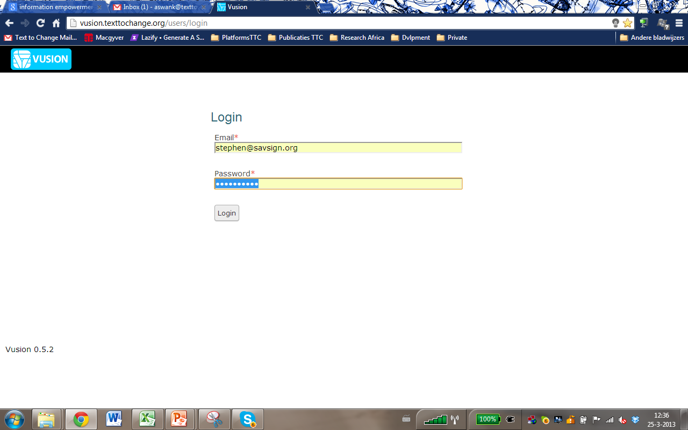
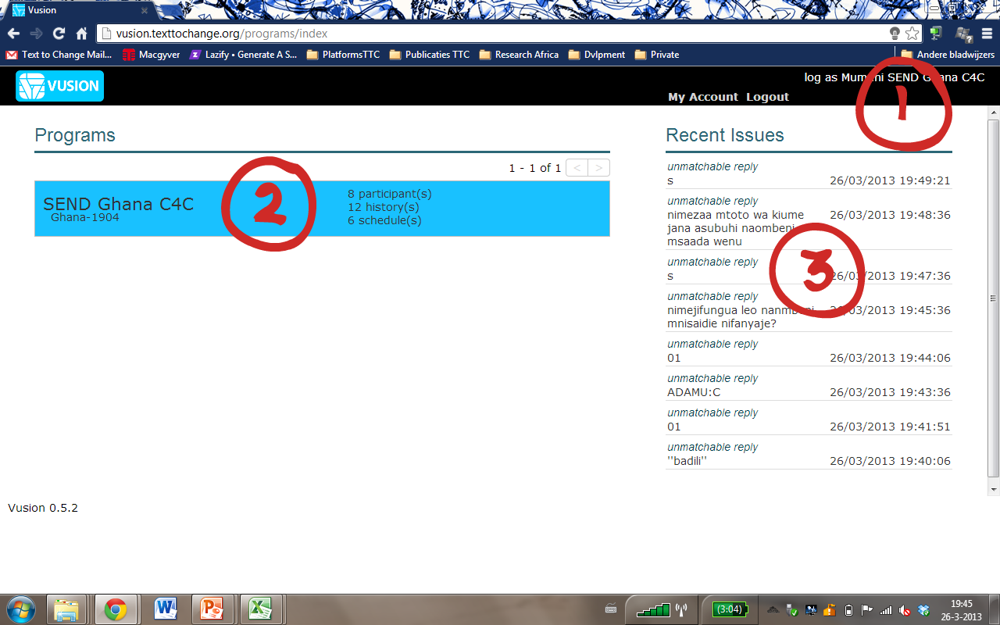
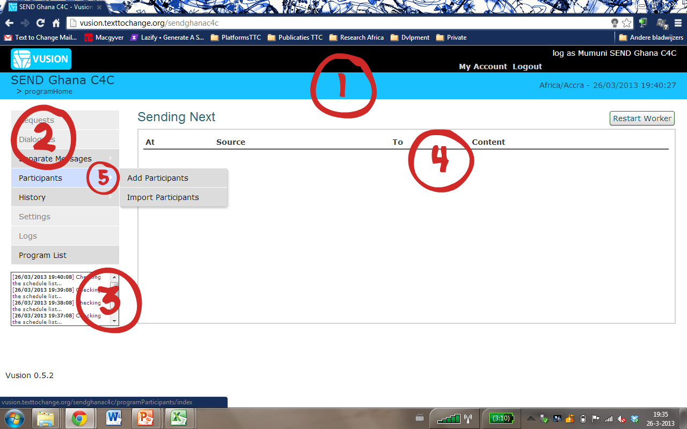

Introduction à  :index:`l’interface de Vusion`
----------------------------------------------
Ici, nous allons couvrir l'interface de Vusion. L'objectif de ce guide est d'être capable de se connecter, sélectionnez votre programme, et se familiariser avec l'interface du programme

Se connecter
=======

C'est l'écran de connexion de Vusion. Il peut être accessible en allant sur http://vusion.texttochange.org. Sur cet écran, vous pouvez vous connecter avec les identifiants recus par le responsable  TTC de votre pays. Il s'agit d'une combinaison unique d'une adresse e-mail et mot de passe.

:index:`Index de programme`
=======================
Si vous entrer avec succès le bon email et mot de passe, vous êtes maintenant connecté.
Vous verrez cet écran. Ceci est la page d'index de programme

#. Tout d'abord, notez la barre noire en haut de l'écran. Sur la droite de cette barre, vous pouvez voir le nom de votre compte. Pour afficher ou modifier vos paramètres de compte, vous pouvez cliquez sur Mon compte. Pour vous déconnecter de Vusion, cliquez sur Déconnexion et vous serez redirigé vers l'écran de connexion.

#. Ci-dessous, la barre noire sur la gauche, nous pouvons voir les programmes disponibles pour vous. Les programmes sont présentés comme une boîte bleue. Sur la gauche de cette boîte bleue, vous pouvez voir le nom du programme, le pays, le programme qui est en cours d'exécution et le numéro court pour le programme. Sur la droite de la boîte il ya des statistiques sur le programme. Le nombre de participants, le nombre de messages envoyés et le nombre de messages programmés sont affichés ici.

#. Sur le côté droit de l'écran il ya une liste appelée publication récente. Dans cette liste les publications les plus récentes qui ont émises dans le système sont affichées. Typiquement les messages entrants que le système est incapable de traiter correctement finissent dans cette liste. C'est une bonne chose de regarder quand un programme ne fonctionne pas correctement.

:index:`Tableau de bord du programme`
===========================

Lorsque vous cliquez sur un projet, vous êtes redirigé vers la page d'accueil du programme. A partir de cette page vous pouvez gérer le programme à exécuter pour les tâches que vous souhaitez.

#. La première chose à remarquer, c'est que sous la barre noire en haut de l'écran, il ya maintenant une barre bleue. C'est la barre de programme. Sur le côté gauche de cette barre, vous pouvez voir le nom du projet avec entre parenthèses le pays du programme qui est en cours d'exécution et le numéro court associé au programme. Sur la droite il y a la date et l'heure de la localisation du programme.
#. Dans la colonne de gauche sous la barre de programme se trouve le menu de navigation. Ce menu donne accès à toutes les différentes fonctions, fonctionnalités et outils que Vusion a à offrir. Comme vous pouvez le voir quelques-unes des options dans le menu de navigation sont grisés. Cela signifie que ces fonctions ne sont pas actuellement disponibles pour votre compte. 
#. Sous le menu de navigation il y a une petite boîte appelée le journal en direct. Cela montre ce que le système est en train de faire en temps réel.
#. A droite du menu de navigation, la file d'attente d'envoi est visible. Cela montre tous les messages qui sont dans la file d'attente d'être envoyés. Comme vous pouvez le voir, en ce moment il est vide. En haut à droite de la file d'attente il y a le bouton Redémarrer le backend, qui commence manuellement un travailleur pour manipuler tous les messages dans la file d'attente.
#. Avant nous pouvons commencer à envoyer des messages que nous avons besoin pour avoir les participants dans le programme. Pour voir, l'importation et la gestion des participants, cliquez sur Participants dans le menu de navigation. Plus d'informations sur la gestion des participants se trouvent dans le guide de  :doc:`gestion des participants <participant_management>`

Il ya des guides disponibles pour expliquer la plupart des fonctionnalités dans le menu de navigation. Ces guides expliquent les caractéristiques et vous montre comment vous pouvez les utiliser.

=======================   ========================================    ===============================================================
**Requests**              Manage requests                             :doc:`Requests guide </advanced/requests>`
**Dialogues**             Manage dialogues                            :doc:`Dialogue guide </advanced/dialogues>`
**Seperate Messages**     Send seperate messages                      :doc:`Seperate messages guide <seperatemessage>`
**Predefined Messages**   Predefine messages for later use            see :doc:`Seperate messages guide <seperatemessage>`
**Content Variables**     Set up variables to be used in messages     :doc:`Content Variable guide </advanced/contentvariable>`
**Participants**          Manage participants                         :doc:`Participant Management guide <participant_management>`
**History**               View program history                        :doc:`History Filtering guide <filtering-history>`
**Settings**              Manage the settings of the program
**Logs**                  View program log
**Program List**          See all available programs
=======================   ========================================    ===============================================================

