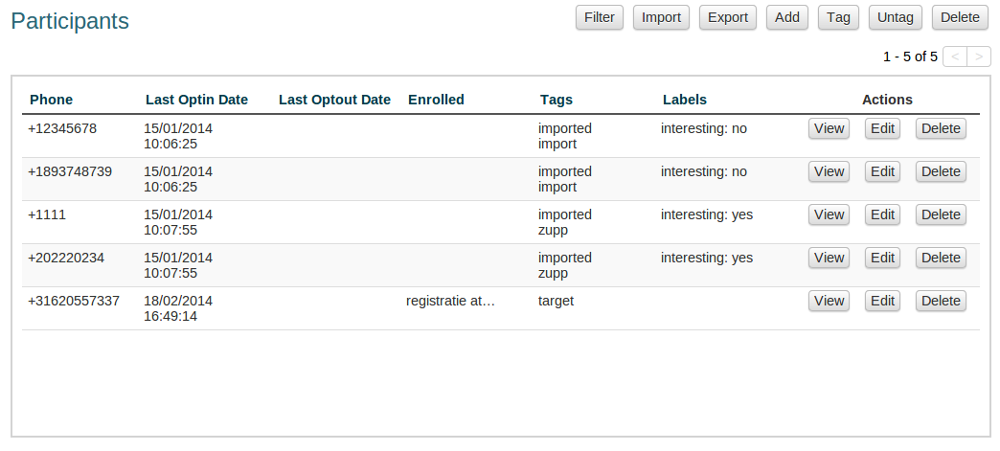
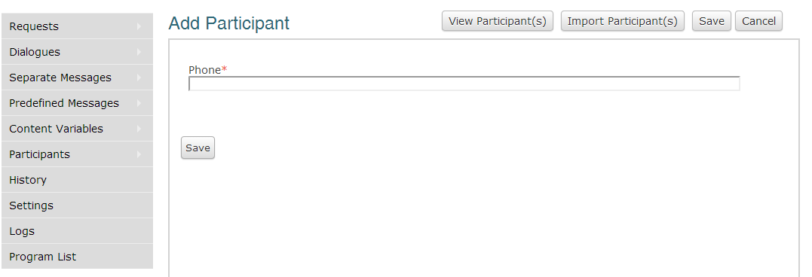
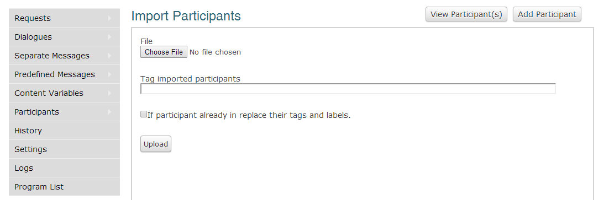
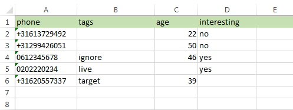
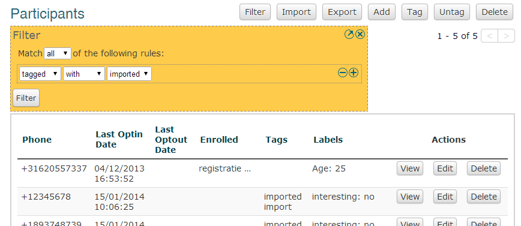

:index:`Gestion des participants`
++++++++++++++++++++++++++++++++++
Cette section traite de la gestion des participants en Vusion. Gestion de vos participants efficace peut être très importante, en particulier dans les programmes avec un grand nombre de participants. Vusion a un certain nombre d'outils disponibles pour vous aider dans les différentes tâches que vous devrez effectuer. 

Les participants sont une partie très importante du système Vusion. Un participant est identifié par son numéro de téléphone cellulaire. Dans la base de données Vusion, plus d'informations peuvent être ajoutées à l'enregistrement des participants, telles que la date du participant a été ajouté à la base de données, les dialogues et divers tags et les labels contenant des informations supplémentaires sur le participant. Ensemble de ces informations peut créer un profil assez complet d'un participant. Cette information peut ensuite être exporté et utilisé pour l'analyse.

	The Vusion participants screen 

:index:`Ajouter des participants`
----------------------------------

L'un des premiers et des plus élémentaires des tâches lorsque vous commencez à l'aide Vusion ajoute participants à la base de données Vusion. Pour envoyer un message, vous devez avoir au moins un participant dans votre base de données.

Ajout d'un seul participant
================================
Pour ajouter un participant, cliquez sur le bouton Ajouter.

	The Vusion add participant screen 

Maintenant, vous verrez un écran où vous pouvez saisir un numéro de téléphone. Entrez le numéro de téléphone du participant que vous voulez ajouter et cliquez sur Enregistrer. Félicitations, vous avez ajouté un participant. Maintenant, ce participant sera affiché sur l'écran des participants.

:index:`Importation des participants` à partir d’un fichier
==============================================================
Dans de nombreux cas l'ajout de participants, un par un n'est pas très efficace. Heureusement, il ya une autre façon d'ajouter des participants et c'est en les important d'un fichier. Utilisation du bouton Importer l'écran des participants importation est atteint. Ici vous pouvez choisir un fichier à partir duquel Vusion va importer les contacts.

	The import participants screen 

Vous pouvez importer à partir d'un fichier CSV ou XLS. La première colonne doit contenir les numéros de téléphone. La deuxième colonne est réservée pour les tags. D'autres colonnes dans le fichier seront considérées comme des tags pour les participants, où l'entrée en haut de chaque colonne sera utilisée comme nom de label.

  La première entrée dans la première colonne, le champ A1 dans Excel, doit toujours contenir le texte "téléphone". La colonne suivante contient des balises. D'autres colonnes peuvent contenir des tags pour les participants

Dans l'écran d’importation des participants, vous pouvez également ajouter automatiquement des tags aux participants importés. Mettre le tag que vous souhaitez ajouter aux participants dans le champ "Tag des participants importés". Lorsque vous avez sélectionné le bon fichier et le tag que vous souhaitez ajouter, cliquez sur Télécharger. Le fichier sera téléchargé et les participants seront ajoutés à la base de données avec des tags corrects attachés. 

:index:`Gestion des participants`
----------------------------------

Gestion de vos participants peut se faire de deux façons. Si vous avez besoin de faire un changement à un seul participant, ou peut-être juste un peu, vous pouvez les gérer individuellement. Vous pouvez également effectuer des actions sur des groupes de participants en sélectionnant d'abord le bon groupe, puis d'exécuter l'action sur l'ensemble du groupe.

Gestion individuelle des participants
======================================
Il ya des cas où vous avez besoin d’effectuer une action sur un participant. Vous pouvez afficher, modifier ou supprimer des participants individuels avec les boutons affichés sur le droit de chaque participant.

- Le bouton **Afficher** pour faire apparaître une page qui affiche les détails concernant le participant. Il affiche des informations de base comme le numéro de téléphone, les tags des participants, mais il montre aussi l'historique du participant. Ici vous pouvez voir les enregistrements de toutes les communications entre Vusion et le participant. Il montre aussi des options pour modifier ou supprimer le participant
- Le bouton **Modifier** affiche un écran où vous pouvez modifier les informations sur le participant. Choses que vous pouvez changer ici sont: Numéro de téléphone, labels, tags et les dialogues du participant est inscrit.
- Le bouton **Supprimer** permet de supprimer le participant de la base de données, y compris l'historique de participant. Cette action est permanente et ne peut être annulée, alors soyez prudent.

:index:`Filtrage des participants`
===================================
Quand les actions doivent être appliquées à de grands groupes de participants, les contrôles sur le dessus font manipulation de grands groupes facile. Les actions que vous pouvez effectuer sur des groupes de participants sont: l'exportation, Tag, Untag et Supprimer. Avant de pouvoir effectuer une action sur un groupe de participants, la première chose à faire est de sélectionner le groupe que vous souhaitez effectuer l'action. Il est très important de choisir le bon groupe, sinon les choses peuvent facilement se tromper. La sélection du groupe est réalisée en utilisant le bouton de filtre.

Lorsque vous cliquez sur le bouton de filtre, une grosse boîte jaune apparaît. 

	This is the Filter interface. 

Dans l'interface de filtre, vous pouvez créer des filtres pour sélectionner des enregistrements avec certaines informations. Par exemple: comme nous l'avons dit, tous les participants importés à partir d'un fichier sont automatiquement taggés avec le tag: importé. L'aide du filtrage, nous pouvons sélectionner les participants avec ce tag. Pour créer un filtre qui sélectionne tous les participants avec le tag importée, cliquez d'abord sur le filtre. Vous voyez maintenant la boîte de filtre jaune. La première ligne avec les options «tout» et «tout» ne sont pas pertinents pour l'instant. Nous y reviendrons plus tard. Pour l'instant, cliquez sur la liste déroulante vide et sélectionnez "marqué". Maintenant, deux boîtes supplémentaires apparaissent. Ces trois boîtes constituent une règle de filtrage. Pour sélectionner tous les participants avec le tag "importés", sélectionnez un filtre::
	
	tagged | with | imported

Maintenant, cliquez sur Filtre. La page se rechargera et afficher tous les enregistrements des participants avec le tag «importé». Selon cette même méthode, vous pouvez filtrer sur un certain nombre d'autres caractéristiques. Pour le moment, vous pouvez filtrer sur:
 - **téléphone**: filtre sur le numéro de téléphone.
 - **optin**: filtre sur la date de l'opt-in.
 - **optout**: filtre sur la date de l'opt-out.
 - **enrolled**: filtre sur les dialogues participants qui sont enrolled.
 - **tagged**: filtre sur les tags des participants.
 - **labels**: filtre sur les labels des participants ont.

Lorsque vous sélectionnez la propriété que vous souhaitez filtrer, cases appropriées apparaîtront à côté de la première boîte à préciser davantage votre filtre. L'exemple ci-dessus montre comment utiliser un filtre pour effectuer une sélection. La plupart du temps une règle de filtrage aura suffit de sélectionner ce que vous avez besoin, mais parfois vous avez besoin des filtres plus complexes. Dans Vusion il est possible de créer plus d'une règle de filtrage en cliquant simplement sur ​​le symbole "+" à droite de la boîte de filtre. Cela va générer une autre ligne où vous pouvez entrer une autre règle de filtrage. C'est aussi là que la différence entre «tous» et «tout» sur la première ligne de la boîte du filtre devient important.

Supposons que vous ayez deux règles de filtrage, la règle A et B et règle le filtre est réglé sur "correspondre à tous". Maintenant que les enregistrements sont autorisés que la règle de correspondance A et de l'article B. Maintenant lorsque le filtre est réglé sur "correspond à tout", tous les dossiers sont sélectionnés ce match soit règle A ou la règle B. En d'autres termes, lorsque "tout" est sélectionné, les deux règles doivent être respectées, et lorsque "tout" est sélectionné, au moins une règle doit être satisfaite.

Dans Vusion il est possible de créer des filtres avec plusieurs règles de filtrage. Lorsque vous travaillez avec plusieurs règles de filtrage, il est très important de comprendre la différence entre correspondant à "tous" ou "des" règles de filtrage.

Pour examiner de plus près les options de filtrage dans Vusion, s'il vous plaît référez vous au :doc:`guide d’historique de filtrage. <filtering-history>`

Effectuer des actions sur des groupes de participants
=======================================================
Quand vous avez fait le bon choix, vous pouvez effectuer des actions sur tous les participants à la sélection. Les actions disponibles sont:

 - **Tag**: Ajouter un tag à tous les participants sélectionnés. Un tag est un morceau de texte qui peut être utilisé pour marquer certains participants.
 - **Untag**: Enlever un tag de tous les participants sélectionnés.
 - **Exporter**: Télécharger un fichier CSV sur votre ordinateur contenant les participants sélectionnés. Le fichier contiendra tous les détails du participant comme les tags et les labels. Ce guide va vous montrer comment vous pouvez utiliser le fichier CSV dans Excel :doc:`Mini-guide: Utilisation de fichiers CSV dans Excel </advanced/csv_split>`
 - **Supprimer**: Supprime les participants sélectionnés à partir de la base de données. Lorsque vous supprimez les participants, ils sont définitivement supprimés. Cette action ne peut être annulée.

Il est très important de se rappeler que ces opérations fonctionnent sur ​​tous les participants sélectionnés. Cela signifie que vous devez être très prudent, surtout lors de la suppression des groupes de participants.

