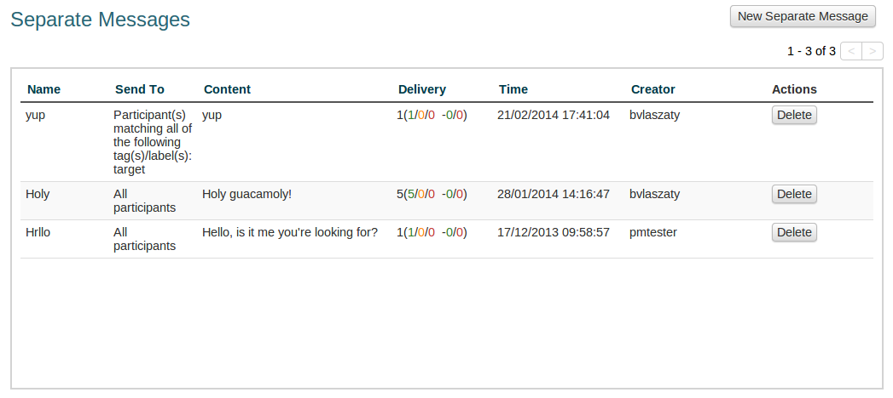
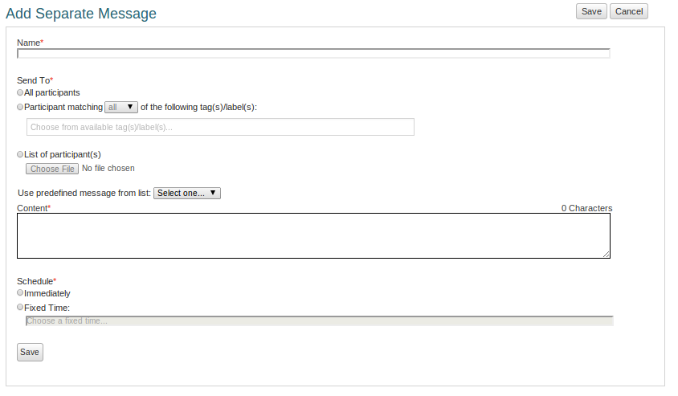
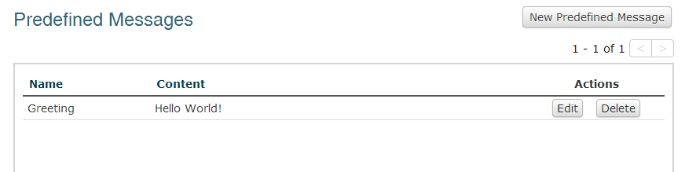
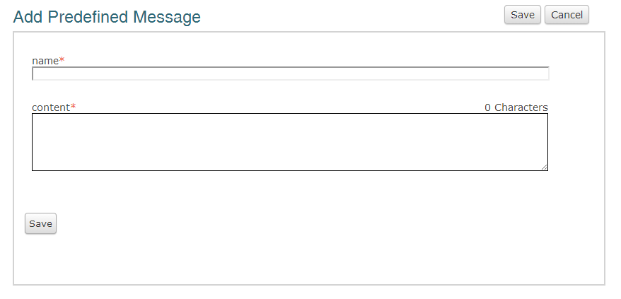

Les messages simples messages et les messages prédéfinis 
++++++++++++++++++++++++++++++++++++++++++++

Envoi d'un message à un groupe de personnes dans Vusion est facile. Ce guide vous expliquera comment vous pouvez envoyer un seul message à un groupe de personnes. Ce type de messagerie est utilisé lorsque aucune interaction avec le participant est tenu.

Les :index:`messages séparés`
============================

Dans le menu du programme, il ya un menu appelé séparée messages. Cela vous amènera à l'écran de messages indépendants.

Dans cet écran, vous pouvez voir une liste des messages envoyés précédemment séparées avec quelques détails à leur sujet. La liste montre aussi les messages programmés. Ce sont des messages qui sont créés et sont prêts à être envoyés à un certain moment dans l'avenir. Si les messages sont prévus mais pas encore envoyés, vous pouvez toujours modifier le message. Pour ce faire, cliquez sur le bouton Modifier à droite du message.

Il ya aussi la possibilité de supprimer un message indépendante. Si le message n'a pas encore été envoyé, le message est supprimé de l'annexe. Si le message a déjà été envoyé, la suppression il supprimer l'enregistrement du message en Vusion.

.. note::
	La plupart des caractéristiques des messages sont explicites. Le Temps indique le temps le message a été créé par exemple. Une chose qui n'est pas si simple est la colonne de livraison. Dans cette colonne, vous verrez six numéros, dont la signification exacte n'est pas immédiatement claire. Ces chiffres représentent l'état de la livraison des messages. Ce sont des détails très techniques qui sont également étroitement liés à la façon dont les messages sont envoyés dans Vusion. Permettez-moi de vous expliquer. Imaginez qu'il ya un message avec ce statut de livraison: **6 (5/4/3 -2/1)**.

	- 6: Le nombre total de messages envoyés

	- 5: *(livré)* Le nombre de messages pour lesquels une confirmation de l'envoi a été reçu de l'opérateur.
	- 4: *(en attente)* Le nombre de messages qui sont encore dans la file d'attente dans Vusion.
	- 3: *(pas)* le nombre de messages qui gor livraison a échoué, selon les rapports de l'opérateur.

	- 2: *(Ack)* Les messages qui ont été envoyés aux opérateurs et dont les opérateurs ont confirmé qu'ils avaient reçu le message.
	- 1: *(Nack)* Les messages qui ont été envoyés à l'opérateur, mais l'opérateur n'a pas encore confirmé que le message a été reçu.
	
Des détails tels que ceux-ci peuvent aider à résoudre quand il ya des questions concernant la connectivité ou des messages qui n'atteignent pas le participant.

Envoyer un message séparé est simple: dans l'écran Messages indépendante, cliquez sur Nouveau message indépendante. Cela vous amènera à l'écran ajouter message simple.

Dans cet écran, vous pouvez définir un message indépendante. Création d'un message indépendante vous oblige à entrer 4 caractéristiques.

 - **Nom**

   Ici vous pouvez entrer un nom que vous voulez donner à ce Message indépendante particulier. Utilisez ce nom pour reconnaître le message. Si vous invitez les gens à un événement, vous pouvez lui donner un nom comme: Invitation Januari Réunion.

 - **Send To**

   Envoyer à définit qui recevrez le message. Ici, il ya 3 options

	 - **Tous les participants:**  Envoyer le message à tous les participants au programme.
	 - **Participant correspondant:** Cette option fonctionne de manière similaire à l'option de filtre de participant [référence à la partie de filtre du guide de gestion des participants]. Ici, vous pouvez sélectionner une ou plusieurs caractéristiques pour les participants. Les participants qui répondent à ces caractéristiques seront recevoir le message. [Plus besoin d'explication?]
	 - **Liste des participants: ** Utilisez les numéros de téléphone à partir d'un fichier à envoyer le message. Cliquez sur Choisir un fichier pour sélectionner un fichier.

 - **Contenu**

Le contenu du message est le message que les participants sélectionnés recevoir. Vous pouvez utiliser un message préalablement défini en sélectionnant une dans le menu déroulant. Vous accédez au contenu du message prédéfini dans la zone de contenu. Création d'un message prédéfini est décrit ci-dessous.

Vous pouvez aussi simplement taper le message que vous voulez envoyer dans la zone de contenu.

 - **Planning**

   Le planning définit le moment que vous voulez Vusion pour envoyer le message. Vous pouvez laisser Vusion faire tout de suite, ou planifier le message qui sera envoyé à un certain moment dans l'avenir. Pour programmer un message, sélectionnez Fixe Temps, et cliquez sur la zone de texte. Un sélecteur apparaîtra pour vous aider à configurer correctement la date et l'heure.

   .. note:: 
      Le sélecteur de date et l'heure fonctionne en fixant la date et l'heure absolue, pas la date et l'heure relative. Le temps que vous entrez est le moment de la journée que le message sera envoyé.

Une fois que ces choses sont réglées, cliquez sur Enregistrer pour enregistrer le message que vous avez créé. Si vous avez programmé le message doit être envoyé immédiatement va maintenant être transmise. Si vous avez programmé le message à envoyer quelque part dans l'avenir, il sera enregistré et envoyé à l'heure. Dans ce cas, vous serez toujours en mesure de faire des ajustements à votre message.

:index:`Modèles ou messages prédéfinis`
===============================

Dans le menu du programme sous séparées messages il ya un menu appelé messages prédéfinis. Dans cet écran, vous pouvez définir et enregistrer un message que vous pouvez ensuite utiliser comme par exemple un message séparé. Cela peut être utile si vous devez envoyer le même message à plusieurs reprises.

Lorsque vous cliquez sur Messages prédéfinis dans le menu du programme, l'écran Messages prédéfinis s'affiche. 

Voici voir une liste de messages actuellement disponibles. En cliquant sur ​​le bouton Modifier, vous pouvez modifier un message prédéfini. En cliquant sur le bouton Supprimer permet de supprimer le message.

Pour créer un message prédéfini, cliquez sur le bouton Nouveau messages prédéfinis. Cela vous donnera un écran où vous pouvez définir un message.

Cet écran est très simple. Il dispose de deux zones de texte. Dans la première zone de texte, vous pouvez saisir un nom pour le message prédéfini. Utilisez un nom qui le rendra facile de reconnaître le message. Ensuite, il ya une boîte où vous pouvez saisir le contenu du message. Ceci est le texte qui sera finalement envoyé aux participants.

Cliquez sur le bouton Enregistrer pour sauvegarder votre message prédéfini de sorte que vous pouvez l'utiliser à un moment plus tard.
